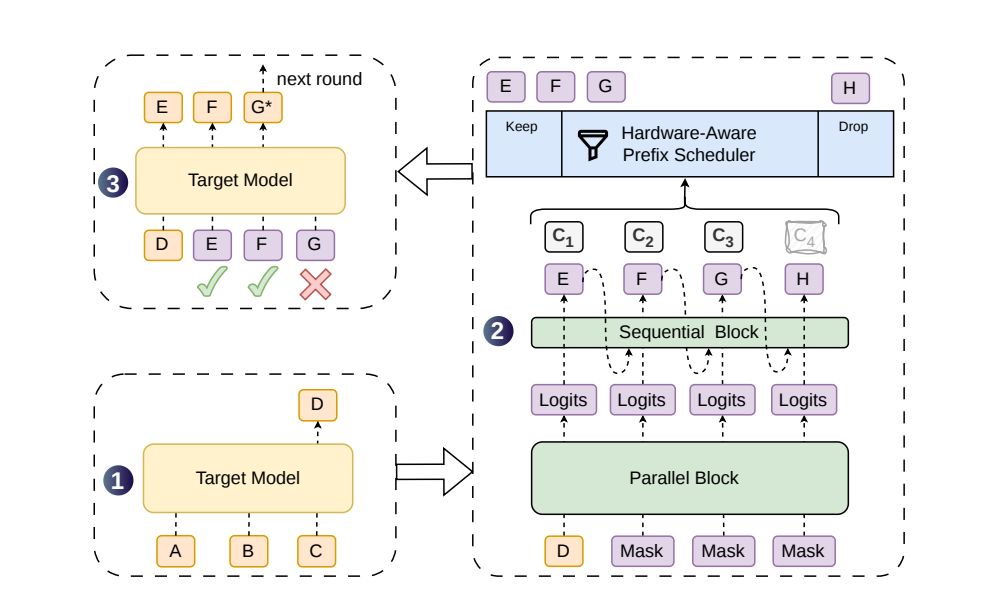
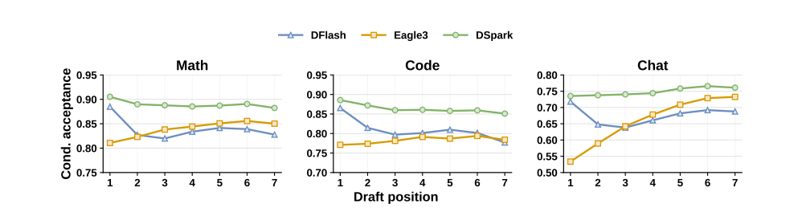
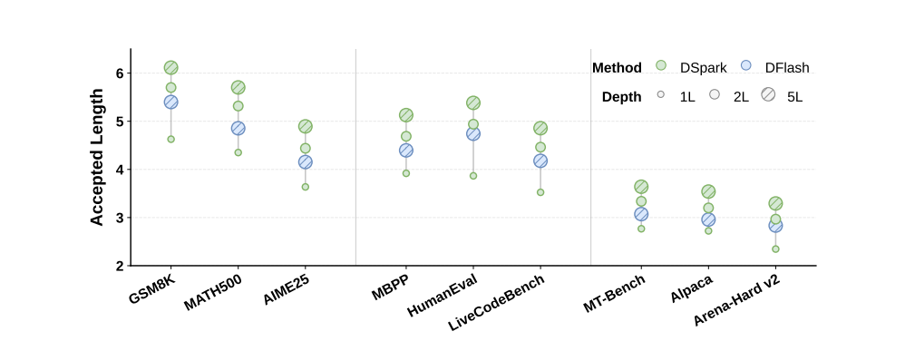
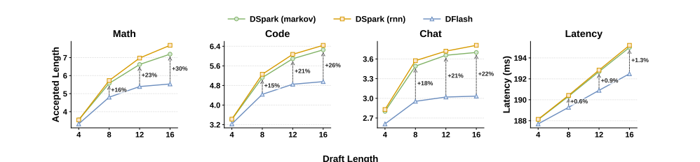
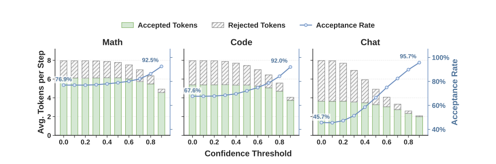
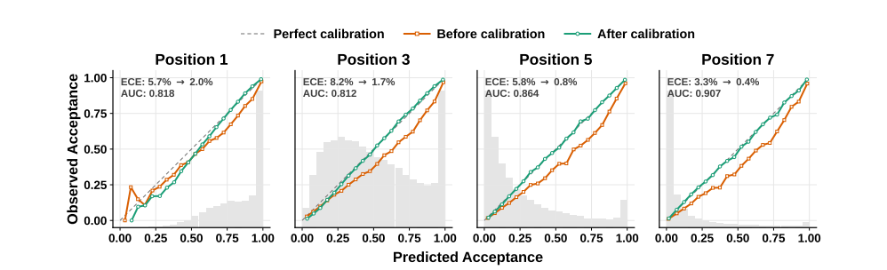
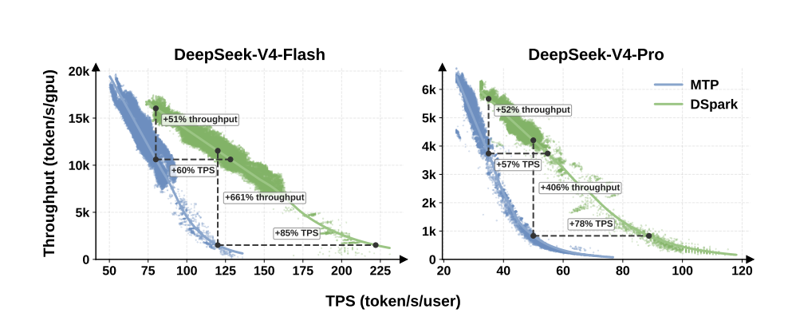
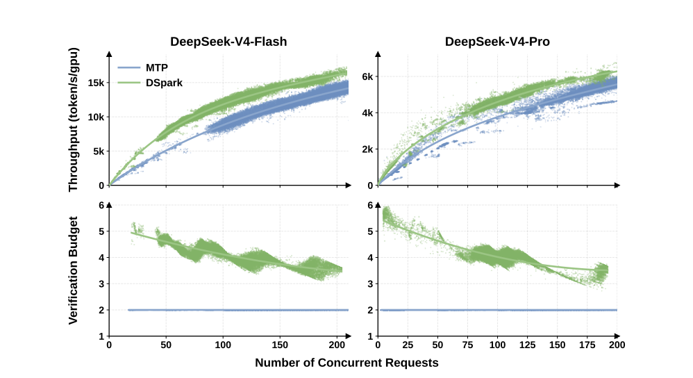

# DSpark: 基于置信度调度的推测解码与半自回归生成

**作者：** 程鑫1,2,*, 余星凯2,*, 邵晨泽2,*, 李佳时2,*, 熊云帆2,*, 钱毅2, 朱嘉琦2, 马世荣2, 张晓康2, 叶佳晟2, 陈钦宇2, 邓成杞2, 于继平2, 戴大迈2, 张正彦2, 魏一轩2, 谭一轩2, 杨文开2, 徐润鑫2, 吴宇2, 徐哲安2, 王轩宇2, 陈牧阳2, 田睿2, 毕晓2, 郝哲文2, 陈少园2, 曹焕奇2, 张文涛2, 徐安怡2, 张辉帅1, 赵东岩1, 梁文峰2

1北京大学 &nbsp; 2DeepSeek-AI

---

## 摘要

推测解码通过将草稿生成与目标验证解耦来加速大语言模型（LLM）推理。虽然最近的并行草稿模型能够在单次前向传播中高效地生成较长的候选 token 序列，但由于缺乏 token 间的依赖关系，它们面临接受率快速衰减的问题。此外，不加区分地验证这些扩展块会将关键的批处理容量浪费在高拒绝风险的 token 上，在高并发服务系统中严重降低吞吐量。我们提出 **DSpark**，一个将高吞吐量并行生成与自适应、负载感知验证相统一的推测解码框架。为了保持草稿质量，DSpark 采用半自回归架构——将并行主干与轻量级序列模块耦合——引入块内依赖建模并缓解尾部衰减。为了优化系统效率，DSpark 采用置信度调度验证，根据估计的前缀存活概率和引擎特定的吞吐量曲线，为每个请求动态定制验证长度。在跨多个领域的离线基准测试中，DSpark 显著提高了相对于最先进的自回归和并行草稿模型的接受长度。在 DeepSeek-V4 服务系统中部署到真实用户流量下时，DSpark 成功缓解了验证浪费。与既定的生产基线（MTP-1）相比，DSpark 在同等吞吐量水平下将每用户生成速度提高了 60%–85%。更重要的是，通过在严格的交互性约束下防止严重的吞吐量退化，它实现了之前无法达到的性能层级，将我们服务系统的帕累托前沿向外推移。为促进社区进步，我们将 DSpark 检查点以及 DeepSpec（一个面向推测解码的算法驱动训练仓库）开源。

---

## 1. 引言

大语言模型以自回归方式生成文本：每个新 token 都需要以前面所有 token 为条件进行一次完整的前向传播，使得推理延迟与输出长度成正比。由此导致的低 GPU 利用率和高用户感知等待时间是生产环境 LLM 服务的主要瓶颈，特别是对于延迟敏感的场景，如实时对话助手和多轮 agent 工作流。推测解码（Chen et al., 2023; Leviathan et al., 2023）提供了一种原则性的解决方案：一个轻量级的**草稿模型**提出一个候选 token 块，全尺寸的**目标模型**通过拒绝采样在单次前向传播中验证整个块，接受与目标分布一致的最长前缀并附加一个 bonus token。因为验证是并行的，且接受规则精确保持目标分布，推测解码在不损失质量的前提下加速生成。

草稿模型的设计决定了草稿延迟和接受率之间的权衡。早期的草稿模型是自回归的（Cheng et al., 2024; Li et al., 2024b），每个位置都以前面采样的 token 为条件。然而，它们的草稿延迟随块大小线性增长，迫使这些方法使用较短的块和较浅的架构。为了打破这一序列瓶颈，**并行草稿模型**（Cai et al., 2024; Chen et al., 2026; Liu et al., 2026a）作为一种有吸引力的替代方案应运而生：所有草稿位置在单次前向传播中产生，使草稿延迟几乎与块大小无关。这种结构性优势理论上允许并行草稿模型高效地生成显著更长的草稿块。

然而，充分释放大型并行草稿块的潜力引入了两个关键瓶颈——一个在生成质量方面，另一个在系统效率方面。首先，由于并行草稿模型独立预测每个位置，它们无法建模块内的 token 间依赖关系。这种独立性导致多模态冲突和尾部位置的快速接受衰减（Gu et al., 2018; Huang et al., 2022b）。其次，确定最优验证长度仍然是一个挑战。虽然并行生成容易产生长草稿块，但不加区分地验证所有提议的 token 会降低系统吞吐量，特别是在高并发工作负载下（Hu et al., 2026; Liu et al., 2024c）。理想的验证长度沿两个维度变化。在数据方面，结构化请求（如代码）自然比开放式对话维持更高的接受率（Abramovich et al., 2026; Xia et al., 2024）。在系统方面，在轻负载下验证额外的 token 几乎是免费的。然而，在重负载下，验证具有高拒绝风险的 token 会占用关键的批处理容量，而这些容量本可以用来服务其他活跃请求（Liu et al., 2024b; Wu et al., 2025）。

为了解决这些瓶颈，我们提出 **DSpark**，一个将高吞吐量并行生成与自适应、负载感知验证相统一的推测解码框架。其核心是通过两个互补的机制解决草稿生成和验证中固有的权衡：

- **第一**，为了克服 token 间依赖关系的缺失，DSpark 采用**半自回归架构**。它保持计算昂贵的草稿主干完全并行，仅附加一个轻量级的串行输出头来注入局部转换信息。这种设计保留了并行模型的草稿速度，同时显著缓解了尾部衰减。

- **第二**，为了解决系统级瓶颈，DSpark 采用**置信度调度验证**。通过将预测每个位置前缀存活概率的置信度头与硬件感知调度器耦合，DSpark 为每个请求动态定制验证长度。该调度器利用实时引擎吞吐量曲线，仅将目标验证预算分配给具有最高预期回报的 token。

我们在受控离线基准测试和生产规模在线部署中广泛评估了 DSpark。在受控离线基准测试中——涵盖数学推理、代码生成和日常对话——DSpark 始终优于强大的基线模型。具体来说，在 Qwen3-4B、8B 和 14B 目标模型（Yang et al., 2025）上，它将宏平均接受长度相对于自回归 Eagle3（Li et al., 2026b）分别提高了 30.9%、26.7% 和 30.0%，相对于并行 DFlash（Chen et al., 2026）分别提高了 16.3%、18.4% 和 18.3%。除了顶层指标，我们细粒度的位置分析揭示了不同草稿模型独特的生成特性，实证展示了 DSpark 如何成功结合并行模型的高初始 token 能力与自回归模型的尾部连贯性。

除了离线评估，我们在 DeepSeek-V4（DeepSeek-AI, 2026）服务系统中部署了 DSpark，以评估其在真实用户流量下的性能。与之前的 MTP-1 生产基线（DeepSeek-AI, 2024）相比，DSpark 显著拓宽了系统的操作范围。具体来说，在匹配的总吞吐量容量下，它始终将每用户生成速度提高 60%–85%（V4-Flash）和 57%–78%（V4-Pro）。此外，在严格的服务水平协议（SLA）下——基线容量严重恶化的情况（如 Flash 的 120 TPS 和 Pro 的 50 TPS）——DSpark 通过缓解验证开销来维持稳健的吞吐量。通过克服这一性能断崖，DSpark 解锁了之前无法达到的严格交互性层级，有效地将 LLM 服务的帕累托前沿向外推移。

为促进开源社区的集体进步，我们公开了我们的工件。具体来说，我们发布了 DeepSeek-V4-Flash（预览版）和 DeepSeek-V4-Pro（预览版）的已训练 DSpark 检查点。此外，我们开源了 DeepSpec（一个算法驱动的训练仓库），包括 Eagle3、DFlash 和 DSpark。这些工件旨在支持关于高效 LLM 服务的进一步研究。

---

## 2. 背景

### 2.1 推测解码

自回归语言模型每次前向传播生成一个 token，使推理延迟与输出长度成正比。推测解码（Chen et al., 2023; Ge et al., 2022; Leviathan et al., 2023）使用轻量级草稿模型 $M_d$ 加速目标模型 $M_t$ 的推理。在每个解码周期，草稿模型提出 $\gamma$ 个候选 token $x_1, ..., x_\gamma$。目标模型在单次前向传播中验证所有候选 token，接受与其自身分布一致的最长前缀。

具体而言，在每个草稿位置 $k$，目标模型计算其自身的分布 $p^t_k$ 并将其与草稿分布 $p^d_k$ 进行比较。token $x_k$ 以概率 $\min\left(1, \frac{p^t_k(x_k)}{p^d_k(x_k)}\right)$ 被接受。验证从左到右进行：在位置 $k$ 的首次拒绝会丢弃所有后续 token $x_{k+1}, ..., x_\gamma$，无论其质量如何。

设 $\tau$ 表示每个周期接受的 token 数量，$T_{draft}$ 和 $T_{verify}$ 分别为草稿和验证遍次的墙钟时间。每个生成 token 的平均延迟为：

$$
L = \frac{T_{draft} + T_{verify}}{\tau}
\tag{1}
$$

因此，提高加速效果归结为三个杠杆：降低 $T_{draft}$（更快地草稿）、提高 $\tau$（更好地草稿）或减少有效 $T_{verify}$（更聪明地验证）。

### 2.2 草稿模型架构

草稿模型的设计决定了 $T_{draft}$ 和 $\tau$ 之间的权衡。现有方法分为两类。

**自回归草稿模型**：自回归草稿模型按顺序生成草稿 token，每个位置以前面采样的 token 为条件（DeepSeek-AI, 2024; Li et al., 2024b,c, 2026b; Zhang et al., 2025）。这种显式依赖提供了强大的建模能力，但草稿成本随块大小线性增长：$T_{draft} \propto \gamma$，这迫使自回归草稿模型使用较小的 $\gamma$ 和较浅的架构来保持较低的 $T_{draft}$。为补偿较短的块，基于树的验证（Miao et al., 2024）将候选 token 扩展为树，并通过树注意力验证多条路径，但大量的验证 token 会降低整体服务吞吐量。

**并行草稿模型**：并行草稿模型在单次前向传播中产生所有 $\gamma$ 个草稿 token，使 $T_{draft}$ 几乎与块大小无关（Cai et al., 2024; Chen et al., 2026; Li et al., 2025a; Liu et al., 2026a; Sandler et al., 2026）。这允许使用显著更大的块（例如 $\gamma = 16$）而不会按比例增加延迟。

其中，DFlash（Chen et al., 2026）是最先进的并行草稿模型，它从目标模型提取丰富的上下文特征（KV 注入）来条件化其草稿模型。在预填充期间，来自一组目标层 $\{l_1, ..., l_m\}$ 的隐藏状态被拼接并投影到草稿隐藏空间：

$$
\mathbf{H}^{\text{ctx}} = \text{RMSNorm}\left(W_c [\mathbf{H}^{(l_1)}; ...; \mathbf{H}^{(l_m)}]\right)
\tag{2}
$$

其中 $W_c \in \mathbb{R}^{d \times md}$ 是一个共享投影。这些上下文特征通过沿键和值的序列维度与草稿块表示拼接，注入到每个草稿层：

$$
\mathbf{K}_i = [W^K_i \mathbf{H}^{\text{ctx}}; W^K_i \mathbf{H}^d], \quad \mathbf{V}_i = [W^V_i \mathbf{H}^{\text{ctx}}; W^V_i \mathbf{H}^d]
\tag{3}
$$

块内的所有位置彼此双向关注以及关注注入的目标上下文。草稿模型共享目标模型的嵌入层和语言建模头（两者均冻结）。它接受一个锚点 token 的嵌入，后跟 $\gamma$ 个 mask token 嵌入，并在单次前向传播中为所有 mask 位置产生 logits。由于无论块大小如何，草稿只需要单次前向传播，DFlash 在相同的延迟预算下可以比自回归草稿模型使用更深的架构和更大的块。

---

## 3. 架构

DSpark 的总体架构如图 1 所示。回顾公式 1，推测解码的每 token 延迟为 $L = (T_{draft} + T_{verify}) / \tau$。自回归草稿模型实现高 $\tau$，但付出 $T_{draft} \propto \gamma$ 的代价；并行草稿模型将 $T_{draft}$ 压缩到单次传播，但牺牲 $\tau$，因为每个位置是独立预测的。同时，固定长度验证将 $T_{verify}$ 浪费在几乎肯定会被拒绝的低置信度尾部 token 上。DSpark 通过两个互补的组件解决这些限制：

- **半自回归生成**（第 3.1 节）：并行主干处理草稿计算的主体，保持 $T_{draft}$ 几乎与 $\gamma$ 无关。然后一个轻量级序列块在草稿 token 之间注入依赖关系，以最小的额外延迟提高 $\tau$。

- **置信度调度验证**（第 3.2 节）：置信度头估计每个位置的接受概率，硬件感知调度器利用这些估计剪枝低置信度尾部 token，减少不必要的验证计算。

结合使用，这两个组件使 DSpark 能够**更好地草稿**和**更聪明地验证**。

**图 1 | DSpark 架构和解码周期。** 给定提示 token ABC，目标模型执行一步生成下一个 token D，它作为草稿阶段的锚点。使用 D 作为输入，DSpark 采用重并行主干和轻量级序列头生成草稿 token EFGH 及其相应的置信度分数 $c_1$–$c_4$。硬件感知前缀调度器然后评估这些分数，保留前缀 EFG 并丢弃低置信度 token H。最后，目标模型并行验证调度的前缀。如图所示，E 和 F 被接受，而 G 被拒绝，提示模型生成修正后的 token G* 来完成当前轮次。

### 3.1 半自回归生成

并行草稿模型在单次前向传播中产生所有 $\gamma$ 个草稿 logits，因此每个预测不能以块中其他地方采样的 token 为条件。当上下文允许多种合理的延续时，例如"of course"和"no problem"，并行草稿模型可能产生不连贯的组合，如"of problem"或"no course"，因为每个位置是对所有可能的前驱进行边缘化，而不是以实际采样的那一个为条件（Gu et al., 2018; Huang et al., 2022a）。因此，接受率沿块快速衰减，浪费了草稿和验证计算。因此我们采用**半自回归**结构，将草稿生成分为两个阶段：

**并行阶段**：并行主干（在我们的实现中为 DFlash（Chen et al., 2026））在整个块上运行单次前向传播，产生隐藏状态 $h_1, ..., h_\gamma$ 和基础 logits $U_1, ..., U_\gamma$。我们对原始 DFlash 主干做了一个小修改：不是输入一个锚点 token 加 $\gamma$ 个 mask token 并仅预测 mask 位置，而是将锚点本身视为第一个预测位置，因此 $\gamma$ 个输入 token（锚点 + $\gamma-1$ 个 mask）产生 $\gamma$ 个草稿 logits。这减少了草稿计算量，同时保持了类似的草稿质量。

**序列阶段**：序列阶段用前缀依赖的转换偏差 $B_k(x_0, x_{<k}, x_k)$ 补充基础 logits，允许每个草稿位置以块内先前采样的 token 为条件。序列阶段通过自回归分解引入因果块分布，而非定义全局归一化的能量模型：

$$
P(X | x_0) = \prod_{k=1}^{\gamma} p_k(x_k | x_0, x_{<k}), \quad p_k(v | x_0, x_{<k}) = \frac{\exp(U_k(v) + B_k(x_0, x_{<k}, v))}{\sum_{u \in \mathcal{V}} \exp(U_k(u) + B_k(x_0, x_{<k}, u))}
\tag{4}
$$

这里，$x_0$ 表示前一个验证周期的锚点 token，$U_k$ 是并行主干在位置 $k$ 产生的基础 logit 向量，$\mathcal{V}$ 是词汇表。在推理时，序列块根据 $p_k(\cdot | x_0, x_{<k})$ 从左到右采样。因为这种采样过程本质上是顺序的，该块必须在计算上保持轻量（$T_{sequential} \ll T_{parallel}$），以便整体草稿延迟仍然由并行阶段主导。我们描述序列块的两种实现如下。

- **马尔可夫头 (Markov Head)**：最简单的实现将 $B_k$ 限制为仅依赖于紧接的前一个 token，将其简化为一个一阶转换 $B(x_{k-1}, x_k)$。原则上这是一个完整的 $V \times V$ 矩阵 $B$；我们通过低秩分解 $B = W_1 W_2$ 来近似它，其中 $W_1 \in \mathbb{R}^{V \times r}$，$W_2 \in \mathbb{R}^{r \times V}$。给定前一个 token $x_{k-1}$，位置 $k$ 的转换偏差为：

$$
B(x_{k-1}, \cdot) = W_1[x_{k-1}] W_2 \in \mathbb{R}^V
\tag{5}
$$

其中 $W_1$ 作为嵌入查找表，$W_2$ 作为 logit 投影。低秩分解（默认 $r = 256$）保持存储和每步计算量都很小，即使对于大词汇表也能使序列循环高效。回到之前的例子：一旦位置 1 采样了"of"，马尔可夫头会提升"course"并抑制"problem"在位置 2，从而缓解跨模式冲突。

- **RNN 头 (RNN Head)**：马尔可夫头在一步之后是无记忆的——位置 $k$ 无法访问 $x_{k-1}$ 之前的 token。RNN 头通过维护一个循环状态 $s_k$ 来放松这一限制，该状态在块内累积完整的前缀历史。在每一步，模块将当前状态 $s_{k-1} \in \mathbb{R}^r$、前一个 token 嵌入 $W_1[x_{k-1}] \in \mathbb{R}^r$ 和主干隐藏状态 $h_k \in \mathbb{R}^d$ 拼接成输入向量 $z_k = [s_{k-1}; W_1[x_{k-1}]; h_k] \in \mathbb{R}^{2r+d}$，然后应用单次门控更新：

$$
s_k = \sigma(W_g z_k) \odot s_{k-1} + (1 - \sigma(W_g z_k)) \odot \tanh(W_c z_k)
$$
$$
B_k(x_{<k}, \cdot) = W_2^\top \tanh(W_o z_k)
\tag{6}
$$

其中 $W_g, W_c, W_o \in \mathbb{R}^{(2r+d) \times r}$ 由单个线性投影联合参数化，该投影被分割为门控、候选和输出组件。状态 $s_0$ 初始化为零。

### 3.2 置信度调度验证

半自回归架构使 DSpark 能够高效生成大草稿块。然而，产生更多草稿 token 并不会自动转化为更高的端到端加速。不加区分地验证完整草稿块实际上会降低整体系统吞吐量，特别是在高并发场景中（Hu et al., 2026; Liu et al., 2024c）。

这种性能瓶颈源于两个相互作用的因素。首先，在数据方面，草稿接受率本质上因领域而异：结构化文本（如代码）自然产生高接受率，而开放式对话的接受率显著较低（Abramovich et al., 2026; Xia et al., 2024）。其次，在系统方面，验证额外 token 的实际成本严格取决于引擎负载。在轻系统负载下，即使被拒绝，额外验证的惩罚也最小。然而，在高并发部署下，每个不必要的验证都会占用目标模型批处理容量，而这些容量本可以用来服务其他活跃请求（Liu et al., 2024b; Wu et al., 2025）。

因此，完全释放大草稿块的潜力需要一个统一的机制，仅将目标模型计算路由到具有正预期回报的 token。DSpark 通过将预测前缀存活概率的**置信度头**（第 3.2.1 节）与根据当前系统负载动态确定最优验证长度的**硬件感知前缀调度器**（第 3.2.2 节）耦合来实现这一目标。

#### 3.2.1 置信度头

受 Huang et al. (2024); Wang et al. (2026) 的启发，置信度头为每个草稿位置 $k$ 输出标量估计 $c_k \in (0, 1)$。关键的是，$c_k$ 建模的是在块中所有前面 token 已被接受的条件下，位置 $k$ 的草稿 token 将在目标验证中存活的**条件**概率。该架构采用轻量级线性投影后接 sigmoid 函数：

$$
c_k = \sigma\left(w^\top [h_k; W_1[x_{k-1}]]\right)
\tag{7}
$$

其中 $h_k$ 是主干的隐藏状态，$W_1[x_{k-1}]$ 是前一个草稿 token 的马尔可夫嵌入。我们使用每步的分析接受率 $c^*_k$ 来监督 $c_k$。该率由草稿分布 $p^d_k$ 和目标分布 $p^t_k$ 之间的总变分距离决定：

$$
c^*_k = 1 - \frac{1}{2} \|p^d_k - p^t_k\|_1
\tag{8}
$$

**后验校准**：与基于阈值的验证启发式方法（Huang et al., 2024; Li et al., 2024b; Zhang et al., 2026b）不同，后者仅需要置信度分数正确排序草稿 token 质量，我们的硬件感知调度方法（详见第 3.2.2 节）精确需要累积接受概率的绝对幅度来计算预期接受长度 $\tau$。因为神经置信度估计通常过于自信（Guo et al., 2017; Ovadia et al., 2019），直接使用原始置信度分数会扭曲吞吐量估计，导致次优调度。

为解决这一问题，我们引入**序列温度缩放 (Sequential Temperature Scaling, STS)**。因为每个 $c_i$ 建模一个条件概率，链式法则规定草稿前缀被接受的联合概率分解为累积乘积 $\prod_{i \le k} c_i$。使用留出的验证集，STS 从左到右连续校准此联合概率。具体来说，在每个位置 $k \in \{1, ..., \gamma\}$，我们执行简单的一维网格搜索来找到使累积乘积的预期校准误差（ECE, Naeini et al., 2015）最小化的最优温度标量，同时保持所有前面位置已校准的分数固定。关键的是，温度缩放是一个保序变换：它修正预测概率以匹配经验接受率，而不破坏置信度头学习的相对草稿 token 排名。

#### 3.2.2 硬件感知前缀调度器

**算法 1：硬件感知前缀调度器**

**输入：** 活跃请求 $r \in \{1, ..., R\}$；每请求置信度序列 $c_{r,1}, ..., c_{r,\gamma}$；已测量的步进曲线 SPS($B$)
**输出：** 选定的每请求前缀长度 $\ell^*_1, ..., \ell^*_R$

1. 对 $r = 1$ 到 $R$ 执行：
2. &nbsp;&nbsp;&nbsp;&nbsp;计算前缀存活概率：$a_{r,j} \leftarrow \prod_{i \le j} c_{r,i}$，$j = 1, ..., \gamma$
3. 构建候选空间 $\mathcal{E} \leftarrow \{(r, j) \mid a_{r,j} > 0\}$ 并按 $a_{r,j}$ 降序排序
4. 初始化状态：$\ell_r \leftarrow 0$ 对所有 $r$；批大小 $B \leftarrow R$；预期接受数 $\tau^* \leftarrow R$
5. 初始化追踪：$\Theta_{best} \leftarrow R \cdot \text{SPS}(R)$；选定长度 $\ell^*_r \leftarrow 0$ 对所有 $r$
6. 对排序后的 $\mathcal{E}$ 中每个 $(r, j)$ 执行：
7. &nbsp;&nbsp;&nbsp;&nbsp;$\ell_r \leftarrow j$；$B \leftarrow B + 1$；$\tau^* \leftarrow \tau^* + a_{r,j}$
8. &nbsp;&nbsp;&nbsp;&nbsp;当前吞吐量 $\Theta \leftarrow \tau^* \cdot \text{SPS}(B)$
9. &nbsp;&nbsp;&nbsp;&nbsp;如果 $\Theta > \Theta_{best}$：
10. &nbsp;&nbsp;&nbsp;&nbsp;&nbsp;&nbsp;&nbsp;&nbsp;$\Theta_{best} \leftarrow \Theta$；更新选定长度 $\ell^*_r \leftarrow \ell_r$
11. &nbsp;&nbsp;&nbsp;&nbsp;否则：
12. &nbsp;&nbsp;&nbsp;&nbsp;&nbsp;&nbsp;&nbsp;&nbsp;终止
13. 返回 $(\ell^*_1, ..., \ell^*_R)$，实现 $\Theta_{best}$

先前的方法（Huang et al., 2024; Li et al., 2024b）通常对置信度分数应用静态阈值来确定验证长度。虽然在孤立的单请求假设下有效，但静态阈值在高并发生产系统中可能是次优的，其中验证草稿 token 的效用很大程度上取决于当前系统负载。

为解决这一问题，我们将验证长度选择表述为全局吞吐量最大化问题（算法 1）。考虑一批 $R$ 个活跃请求。对于请求 $r$，令 $c_{r,1}, ..., c_{r,\gamma}$ 为每位置置信度估计，令 $\ell_r \in \{0, ..., \gamma\}$ 表示调度的验证长度。因为推测解码仅作为连续前缀动态接受草稿 token，位置 $j$ 的 token 存活概率是累积乘积 $a_{r,j} = \prod_{i \le j} c_{r,i}$。

在单个验证步中，发送到目标模型的总批大小（以 token 计）为 $B = \sum_{r=1}^{R}(1 + \ell_r)$，成功接受的预期 token 数为 $\tau = \sum_{r=1}^{R}\left(1 + \sum_{j=1}^{\ell_r} a_{r,j}\right)$。令 SPS($B$) 表示引擎吞吐量（以每秒步数衡量），对于给定的前向传播批大小 $B$。关键的是，此容量曲线在引擎初始化时测量一次，并存储为轻量级成本表。然后，我们的调度器旨在通过动态选择验证长度 $\ell_1, ..., \ell_R$ 来最大化预期的系统级 token 吞吐量 $\Theta = \tau \cdot \text{SPS}(B)$。

虽然寻找 $\Theta$ 的全局最大值看似是组合搜索，但目标结构允许高效的贪心解。因为 $a_{r,j}$ 关于 $j$ 单调不增（即 $a_{r,j} \le a_{r,j-1}$），将请求 $r$ 的验证长度从 $j-1$ 扩展到 $j$ 的预期接受 token 边际增益恰好为 $a_{r,j}$。这种单调性确保按 $a_{r,j}$ 全局排序候选 token 自然尊重块内前缀依赖关系。因此，如果总验证批大小 $B$ 固定，则最优分配 $\{\ell_r\}$ 将通过从所有 $\{a_{r,j}\}$ 的全局池中贪心选择具有最高存活概率的草稿 token 来确定。

基于这一洞察，优化可以沿此贪心接纳路径进行评估。我们首先按存活概率降序对所有有效前缀扩展进行全局排序。为动态确定最优目标批大小 $B$，我们从排序池中增量接纳 token，通过从预测量成本表中进行 $O(1)$ 查找来更新预期吞吐量 $\Theta$。

**无损推测解码严格要求非预期性质：接纳决策不能依赖于未来的候选 token（Chen et al., 2023; Leviathan et al., 2023）。** 因为我们的置信度头依赖于先前采样 token 的马尔可夫特征，计算下一个存活概率 $a_{r,k+1}$ 明确需要已实例化的候选 $x_{r,k}$。因此，回溯全局搜索会无意中将 $x_{r,k}$ 泄漏到步骤 $k$ 的接纳决策中，引入选择偏差（我们在附录 A 中提供了一个说明此理论违规的具体反例）。

为强制执行严格因果性，调度器（算法 1）采用**提前停止机制**。通过在吞吐量下降时（$\Theta \le \Theta_{best}$）立即中断贪心搜索，截断决策仅依赖于到该确切步骤为止已处理的前缀。这将接纳事件与未来 token 隔离，确保精确的目标分布恢复。注意，此逐步提前停止产生全局最大吞吐量当且仅当目标 $\Theta$ 是单峰的，这隐含假设一个平滑衰减的硬件容量曲线。我们在第 5.2 节中讨论了真实世界中非平滑 SPS 特性和异步系统管道所需的工程适配。

### 3.3 训练

在训练期间，我们从每个目标序列中随机采样多个锚点位置，形成 $\gamma$-token 块作为训练数据。目标模型在整个训练过程中保持冻结；草稿模型共享其嵌入层和语言建模头并保持它们冻结，仅更新主干草稿模型、序列块和置信度头。

训练目标由三项组成：交叉熵损失 $\mathcal{L}_{ce}$、分布匹配损失 $\mathcal{L}_{tv}$ 和置信度损失 $\mathcal{L}_{conf}$。所有三项都经过位置加权 $w_k = \exp(-(k - 1) / \gamma)$（Chen et al., 2026），该加权强调对基于前缀验证下预期接受长度贡献更多的早期块位置。

交叉熵损失 $\mathcal{L}_{ce}$ 训练草稿模型预测正确的下一个 token：

$$
\mathcal{L}_{ce} = -\sum_{k=1}^{\gamma} w_k \log p^d_k(x^*_k)
\tag{9}
$$

其中 $x^*_k$ 是真值 token，$p^d_k$ 是草稿分布。

分布匹配损失 $\mathcal{L}_{tv}$ 惩罚草稿分布和目标分布之间的总变分距离：

$$
\mathcal{L}_{tv} = \sum_{k=1}^{\gamma} w_k \|p^d_k - p^t_k\|_1
\tag{10}
$$

因为总变分距离是接受率的直接代理：每步接受概率等于 $1 - \frac{1}{2}\|p^d - p^t\|_1$（Leviathan et al., 2023），最小化 $\mathcal{L}_{tv}$ 直接最大化预期接受率。

置信度损失 $\mathcal{L}_{conf}$ 是二元交叉熵，训练置信度头预测来自公式 8 的软接受标签 $c^*_k$：

$$
\mathcal{L}_{conf} = -\sum_{k=1}^{\gamma} w_k \left[c^*_k \log c_k + (1 - c^*_k) \log(1 - c_k)\right]
\tag{11}
$$

总目标是三项的加权组合（默认权重 $\alpha_{ce} = 0.1$，$\alpha_{tv} = 0.9$，$\alpha_{conf} = 1.0$）：

$$
\mathcal{L} = \alpha_{ce} \mathcal{L}_{ce} + \alpha_{tv} \mathcal{L}_{tv} + \alpha_{conf} \mathcal{L}_{conf}
\tag{12}
$$

---

## 4. 实验

在本节中，我们使用离线基准测试验证 DSpark 的草稿质量，并在第 5 节中报告在线生产流量下置信度调度器的效果。实验设置在第 4.1 节中描述，主要结果在第 4.2 节中，额外分析包含在第 4.3 节中。

### 4.1 实验设置

**目标模型和草稿模型**：我们在跨不同规模和模型系列的四个目标模型上评估 DSpark：Qwen3-{4B, 8B, 14B}（Yang et al., 2025）和 Gemma4-12B（Google DeepMind, 2026）。对于草稿模型，我们将 DSpark 与两个代表性草稿模型进行比较：DFlash（Chen et al., 2026），最先进的并行草稿模型，以及 Eagle3（Li et al., 2026b），基于训练时测试（TTT）的自回归草稿模型。为公平比较，我们在相同的训练框架和相同的数据上重新训练所有草稿模型。我们将 Eagle3 的 TTT 长度（7）与 DFlash 和 DSpark 使用的块大小（7）对齐，并对所有草稿模型使用相同的目标模型特征层。对于草稿模型层数，Eagle3 设置为 1，DSpark 和 DFlash 设置为 5（Chen et al., 2026）。除非另有说明，DSpark 指马尔可夫头变体；我们在第 4.3.2 节中研究 RNN 头变体。

**训练数据**：我们使用 Open-PerfectBlend，这是 PerfectBlend（Xu et al., 2024）的开源版本，包含 130 万个样本。它是一个通用指令数据集，包含对话（17.6%）、数学（39.4%）、代码（38.9%）和指令遵循数据（4.1%）。我们仅使用 Open-PerfectBlend 中的提示；响应由每个目标模型使用推荐的采样参数重新生成。每个草稿模型训练 10 个 epoch 以确保完全收敛。对于数据生成和评估，我们采用非思考模式。

**评估协议**：我们在三个领域评估不同算法的性能：
1. **数学推理**：包括 GSM8K（Cobbe et al., 2021）、MATH500（Lightman et al., 2024）和 AIME25（Zhang and Math-AI, 2025）。
2. **代码生成**：包括 MBPP（Austin et al., 2021b）、HumanEval（Chen et al., 2021）和 Live-CodeBench（Jain et al., 2025）。
3. **日常对话**：包括 MT-Bench（Zheng et al., 2023）、Alpaca（Taori et al., 2023）和 Arena-Hard（Li et al., 2024a, 2025b）。

对于所有基准测试，我们使用标准推测解码（Chen et al., 2023; Leviathan et al., 2023），采样温度设置为 1.0。我们报告每个解码轮次的接受长度（$\tau$）。对于所有草稿模型，我们使用基于链的草稿。

### 4.2 实验结果

为将原始草稿质量与系统级调度策略隔离开来，我们的离线评估禁用置信度调度器，强制所有草稿模型提出固定数量的 token。主要结果（以每轮平均接受长度 $\tau$ 衡量）报告在表 1 中。

**表 1 | 主要推测解码结果。** 我们报告不同目标模型和领域的每解码轮次接受长度（$\tau$）（越高越好）。**粗体**标记最佳结果。

| 目标模型 | 草稿模型 | GSM8K | MATH | AIME25 | MBPP | HumanEval | LCB | MT-Bench | Alpaca | Arena-Hard |
|---------|---------|-------|------|--------|------|-----------|-----|----------|--------|------------|
| Qwen3-4B | Eagle3 | 5.14 | 4.62 | 3.92 | 3.69 | 4.16 | 3.77 | 2.39 | 2.26 | 2.55 |
| | DFlash | 5.40 | 4.85 | 4.15 | 4.40 | 4.74 | 4.18 | 3.07 | 2.96 | 2.83 |
| | **DSpark** | **6.11** | **5.70** | **4.89** | **5.13** | **5.38** | **4.86** | **3.64** | **3.54** | **3.29** |
| Qwen3-8B | Eagle3 | 5.30 | 4.77 | 3.91 | 3.96 | 4.33 | 4.17 | 2.66 | 2.54 | 2.54 |
| | DFlash | 5.33 | 4.91 | 4.07 | 4.36 | 4.64 | 4.39 | 3.11 | 2.98 | 2.81 |
| | **DSpark** | **6.17** | **5.78** | **5.01** | **5.16** | **5.52** | **5.17** | **3.72** | **3.58** | **3.21** |
| Qwen3-14B | Eagle3 | 5.24 | 4.60 | 3.71 | 3.81 | 4.14 | 4.01 | 2.62 | 2.47 | 2.48 |
| | DFlash | 5.41 | 4.84 | 3.98 | 4.44 | 4.59 | 4.33 | 3.10 | 2.94 | 2.72 |
| | **DSpark** | **6.21** | **5.74** | **4.94** | **5.26** | **5.43** | **5.02** | **3.70** | **3.58** | **3.13** |
| Gemma4-12B | Eagle3 | 5.87 | 5.46 | 4.83 | 4.72 | 5.37 | 4.16 | 3.19 | 3.06 | 2.72 |
| | DFlash | 5.45 | 5.04 | 4.22 | 4.39 | 4.95 | 3.70 | 2.98 | 2.84 | 2.59 |
| | **DSpark** | **6.05** | **5.78** | **5.12** | **5.11** | **5.64** | **4.51** | **3.49** | **3.35** | **2.92** |

DSpark 在所有评估的目标模型和基准领域上始终优于自回归基线（Eagle3）和并行基线（DFlash）。具体来说，跨 Qwen3-4B、8B 和 14B 模型，DSpark 将宏平均接受长度相对于 Eagle3 分别提高了 30.9%、26.7% 和 30.0%。类似地，与 DFlash 相比，DSpark 在三个规模上分别产生了 16.3%、18.4% 和 18.3% 的相对改进。关键的是，这种优势跨模型系列泛化，如 Gemma4-12B 目标上的一致性能增益所示。

除了平均改进之外，表 1 揭示了强烈的**领域效应**：结构化任务（例如 Qwen3-4B 的数学 5.57 和代码 5.12）的接受长度自然高于开放式对话（3.49）。这种数据可预测性的固有权方差意味着静态验证长度经常将计算浪费在极可能被拒绝的尾部 token 上。这直接激励了我们的置信度调度验证，它根据预期接受率动态剪枝草稿块。

### 4.3 实验分析

#### 4.3.1 为什么并行生成能超越自回归？

表 1 呈现了一个反直觉的观察：并行草稿模型（DFlash）和半自回归草稿模型（DSpark）经常比完全自回归草稿模型（Eagle3）产生更长的接受长度。这一发现与标准预期——步进式自回归产生比并行模型更高质量的序列——形成对比（Israel et al., 2026; Ren et al., 2020; Zheng et al., 2025）。

为分析此行为，我们检查超越宏平均接受长度的性能。使用 Qwen3-4B 目标模型和第 4.1 节描述的基准集，我们引入在实际推测解码 rollout 过程中追踪的**位置条件接受率**。

**图 2 | 位置条件接受率。** 我们报告每个草稿位置的经验条件接受率，使用 Qwen3-4B 目标模型在每个领域内的基准测试上进行平均。与标准前缀存活不同，此指标通过移除先前拒绝的惩罚来隔离位置 $k$ 的基础预测质量。注意自回归草稿模型（Eagle3）保持稳定或趋势向上，而并行草稿模型（DFlash）遭受尾部衰减。

**位置 1 的容量优势**：在第一个草稿位置，两种架构都仅基于目标上下文预测下一个 token。这里的性能分歧严格源于架构容量：像 Eagle3 这样的自回归模型由于 $O(\gamma)$ 延迟被限制在浅层网络，而 $O(1)$ 并行草稿模型可以负担更深的网络。这种结构性差距在位置 1 产生了显著的准确率优势，DFlash 的起始值明显高于 Eagle3（例如，数学上 0.88 vs. 0.81，对话上 0.72 vs. 0.53）。因为推测解码作为严格的前缀匹配存活过程运行，第一个 token 具有最高的杠杆——此处的拒绝立即作废整个块。因此，这种初始容量优势不成比例地提升了最终接受长度，解释了为什么并行草稿模型尽管在后期位置存在快速接受衰减，仍在全局上超越自回归模型。

**后期位置的独立性限制**：检查曲线尾部（位置 2 到 7）暴露了独立并行生成的固有限制。随着前面的 token 锁定特定的语义路径，后续 token 自然变得更可预测。像 Eagle3 这样的自回归模型有效地利用这种条件确定性，在块内维持甚至增加条件接受率（例如，对话中从 0.53 到 0.74）。相反，DFlash 遭受快速接受衰减，代码上从 0.87 下降到 0.78，对话上从 0.72 下降到 0.63。因为每个并行位置是对所有可能的前驱 token 进行边缘化，而不是以精确采样的前缀为条件，模型经常提出不一致的尾部组合——一种称为多模态冲突的模式（Gu et al., 2018; Stern et al., 2018）。

**通过半自回归缓解尾部衰减**：前面的分析强调了明确的架构目标：将并行主干的高容量用于初始 token，将自回归模型的依赖关系建模用于后续 token。这直接激励了 DSpark 的半自回归设计。如图 2 所示，DSpark 继承了深度并行草稿模型的高初始接受率（例如，数学上从 0.93 开始）。同时，其轻量级序列头缓解了并行生成典型的快速接受衰减。通过解决这一权衡，DSpark 在整个草稿块中维持高且稳定的条件接受率。

#### 4.3.2 少量自回归，大幅提升

基于第 4.3.1 节的洞察，我们沿两个维度探索 DSpark 的架构设计空间：草稿深度（Transformer 层数）和建议长度（块大小 $\gamma$）。除非另有说明，本节所有实验使用 Qwen3-4B 作为目标模型，并遵循第 4.1 节详述的评估协议。

**草稿深度**：增加 Transformer 层数自然扩展草稿模型的预测能力。为隔离此效果，我们将块大小固定为 7，将 DSpark 层数从 1 变化到 5，并与 5 层 DFlash 基线进行比较。

**图 3 | 草稿深度的影响。** 在固定建议长度下，DSpark 的性能随着添加更多草稿层而提升。值得注意的是，一个浅层 2 层 DSpark 优于更深的 5 层 DFlash 基线，突显了序列建模的参数效率。

**建议长度**：接下来，我们将草稿深度固定为 5 层，在 {4, 8, 12, 16} 范围内缩放草稿长度（建议长度 $\gamma$ 加一个锚点 token），以评估在更长草稿块上的性能。对于 DSpark，我们评估了默认的马尔可夫头和 RNN 头。

**图 4 | 建议长度和延迟开销的影响。** DSpark 在各种块大小下始终优于 DFlash（左侧三个面板）。最右侧面板显示序列头在服务期间引入的延迟开销极小。

**延迟开销**：我们量化 DSpark 中序列生成循环的开销。图 4 最右侧面板报告了每轮引擎延迟——包含一次目标验证传播、并行草稿块前向和串行采样循环——在批大小 128 下测量。为防止序列长度偏差，报告的延迟代表跨不同上下文长度（{512, 1024, 2048, 4096} tokens）的算术平均。由于目标模型在此批大小下主导验证计算时间，序列块的延迟开销可以忽略不计。因此，将草稿长度从 4 扩展到 16 仅在全轮延迟上比 DFlash 基线增加了 0.2% 到 1.3%，尽管在接受长度上提供了高达 30% 的改进。

#### 4.3.3 更聪明地验证，而非更长：置信度头的作用

虽然 DSpark 在长草稿块上维持高接受率，验证整个建议仍然低效（Hu et al., 2026; Huang et al., 2024）。由于第 4.2 节指出的固有权方差，开放式对话中的尾部 token 仍然面临高拒绝风险，使盲目验证成为目标计算的浪费。为评估置信度头是否能有效剪枝这些无前景的尾部，我们使用 Qwen3-4B 进行离线阈值扫描。我们在此隔离验证估计器，将硬件感知前缀调度器（第 3.2.2 节）留给第 5 节中的真实生产评估。

**诊断：静态阈值扫描**：图 5 绘制了跨置信度阈值的每步平均 token 数（柱状图）和总接受率（折线）。

**图 5 | 置信度阈值扫描。** 阈值 0 对应标准固定长度验证。随着阈值增加，总体接受率稳步上升，因为置信度头有效地剪枝了最终会被拒绝的 token（阴影柱状图）。

**从静态阈值到校准调度**：虽然对诊断有用，静态阈值在动态服务环境中是次优的，因为它忽略了系统负载：在低并发下验证低置信度 token 产生最小的机会成本，但在高并发下浪费关键的批处理容量。这种负载依赖性激励了硬件感知前缀调度器。如第 3.2 节所表述，最大化系统级吞吐量要求置信度模型同时表现出强大的预测区分能力和精确的校准，以准确估计累积存活概率。可靠性图（图 6）表明，虽然原始模型实现了强大的区分能力（ROC-AUC（Hanley and McNeil, 1982）范围从 0.81 到 0.90），但它过于自信（ECE 3%–8%）。应用后验 STS（第 3.2.1 节）缓解了这种过度自信，将平均 ECE 降低到约 1% 并产生可靠的存活估计。

**图 6 | Alpaca 数据集上的可靠性图。** 虽然原始置信度估计器实现了强大的区分能力，但其预测固有地过于自信。应用后验校准有助于将前缀存活概率与经验接受率对齐。阴影背景直方图表示不同置信度区间内样本计数的频率分布。

---

## 5. DSpark 的真实世界部署

虽然第 4 节在离线基准测试上确立了 DSpark 的算法增益，将其与 DeepSeek-V4（DeepSeek-AI, 2026）等大规模模型一起部署引入了训练和推理方面的额外系统级挑战。在本节中，我们呈现 DSpark 的端到端生产流水线。我们详细说明我们的可扩展训练机制、部署硬件感知前缀调度器（第 3.2.2 节）所需的系统级优化，以及框架在真实用户流量下的端到端性能。

### 5.1 可扩展且灵活的训练

DSpark 草稿模型与 DeepSeek-V4-Flash 和 DeepSeek-V4-Pro（DeepSeek-AI, 2026）的预览版共同部署。并行主干包含三个 MoE 层（Dai et al., 2024），配备 mHC（Xie et al., 2026）和 128 的滑动窗口注意力。我们将最大块大小配置为 $\gamma = 5$，并使用马尔可夫头进行序列建模。此外，置信度头与草稿模型端到端训练，随后通过 STS 校准以提供可靠的调度信号。

训练草稿模型需要目标模型的输出分布作为监督。在完整文档上下文上评估两个模型会产生巨大的内存占用和跨工作节点通信开销。为解决这些瓶颈，我们在内部训练框架（HAI-LLM）中实现了两项系统级优化：

- **隐藏状态通信**：跨并行工作节点传输目标模型的完整词汇表 logits（$V \approx 10^5$）造成显著的带宽瓶颈。相反，我们临时缓存目标模型的前向传播激活，并仅传达紧接语言建模（LM）头之前的隐藏状态。然后 LM 头投影仅在草稿模型的工作节点上对采样的目标位置本地执行。这将每 token 通信复杂度降低到 $O(d)$，其中 $d$ 是隐藏维度。

- **锚点界定的序列打包**：为将草稿模型的计算成本与目标模型的上下文长度解耦，我们从训练序列中采样固定数量的草稿锚点，并将这些孤立的预测块打包成密集的训练批次。我们通过 token 级注意力索引而不是标准的二维掩码来管理此打包。这在多个独立序列和锚点上维持精确的因果掩码，避免了与标准填充相关的计算和内存开销。

### 5.2 实践中的硬件感知前缀调度器

在第 3.2.2 节中，算法 1 提供了理论上合理且无损的调度机制。然而，将此算法直接部署到生产环境暴露了与真实世界基础设施的两个基本冲突。首先，算法假设平滑、单峰的容量曲线，而真实硬件容量 SPS($B$) 固有地离散，表现出锯齿状、阶梯式退化（Yan et al., 2020）。其次，算法需要每步调度动态草稿 token，这与持续 CUDA 图重放（Fireworks AI, 2023）和零开销调度（ZOS, Zheng et al., 2024; Zhu et al., 2025）冲突。

为在系统兼容性、吞吐量和算法正确性之间导航权衡，我们将调度器适配为**异步**运行。因为 ZOS 要求下一步的批大小在当前步完成之前已知，同步调度将不可避免地使 GPU 管道停滞。相反，我们使用两步之前的置信度头输出来近似即将到来的验证容量。在机制上，当前步的候选 token 仍然严格按其实际的、最新的累积置信度分数排序；两步前的历史预测仅用于确定动态截断长度（即批容量限制 $K$）。这有效地将接纳过程转化为动态 top-$K$ 选择。虽然近似容量 $K$ 引入了轻微的时间偏移，选择机制在根本上保持排序：最置信的草稿 token 始终被优先用于验证。此适配完全隐藏了调度延迟并确保无缝 ZOS 集成。

在此异步管道基础上，我们解决了硬件利用率瓶颈。为防止调度器被锯齿状 SPS 断崖困在局部最小值中，我们移除提前停止的 break，启用无约束的全局搜索。通常，此回溯搜索将泄漏未来 token 信息并违反无损保证（附录 A）。然而，我们的 ZOS 驱动适配自然防止了这一点。因为无约束搜索仅评估两步前的历史预测，接纳决策与实际当前 token $x_{r,k}$ 的实现隔离。截断长度固有地仅依赖于两步前可用的信息。因此，异步设计形成因果屏障，在硬件断崖上最大化物理吞吐量，同时保持精确的目标分布。

### 5.3 高吞吐量与低延迟推理

在解码期间，生产服务系统必须同时优化两个竞争目标：每请求延迟和总吞吐量（Kwon et al., 2023; Zhao et al., 2025a; Zhong et al., 2024）。前者决定个体用户的服务质量——这一因素在基于 agent 的工作负载中日益关键（Tiwari et al., 2026）——而后者决定同时服务的用户总数。因为推测解码不可避免地产生浪费的验证计算，它固有地在此权衡中导航，以额外的系统计算换取更快的每请求生成。

然而，在我们的部署设置中，每步处理的请求数量经常受资源限制（例如，每请求固定 KV-cache 容量）和可用用户流量池（例如，RL 长尾负载）的约束。因此，有效批大小持续远低于 GPU 的计算饱和阈值。在这种状态下，传统权衡被简化：给定固定的并发限制，最大化每 GPU 总 token 吞吐量和最大化每用户生成速度（tok/s/user）成为高度相关的目标而非竞争的目标。

为实现此最大吞吐量，异步调度器（第 5.2 节）积极将空闲计算路由到最有前景的草稿 token。然而，执行此动态路由在物理执行层引入了严重挑战：推理框架必须高效支持单个批次内的可变长度查询。标准解码内核针对固定查询长度进行了重度优化；天真地处理可变长度验证前缀会导致由于填充和不均匀工作负载分布造成的严重 GPU 利用率不足。我们通过将物理执行与逻辑序列跟踪解耦来解决此问题。在我们的计算内核中，所有跨不同请求的 token 被展平并作为独立元素相同处理。复杂的序列内依赖关系则严格通过集成到我们稀疏注意力实现中的标记张量来传达。具体在 DeepSeek-V4 架构上，只有索引注意力和压缩内核需要修改以支持此可变长度路由，使动态调度器能够无缝操作而不引入低级执行开销。

### 5.4 真实用户流量下的性能

我们在 DeepSeek-V4-Flash（预览版）和 DeepSeek-V4-Pro（预览版）的生产服务引擎中，将 DSpark-5（配置最大草稿长度 $\gamma = 5$）与 MTP-1（DeepSeek-AI, 2024）基线进行评估。MTP-1 代表先前的生产设置，在 DeepSeek-V4-preview 发布两周后已被 DSpark 取代。历史上在生产中维护此单 token 设置，是因为部署静态多 token 草稿模型（例如 MTP-3/5）在高并发下由于过度验证开销严格降低总吞吐量。因此，将 DSpark 与此既定基线进行比较直接证明了其在动态服务环境中安全解锁更大草稿块性能潜力的能力。在所有图中，散点代表直接从真实用户流量中采样的原始遥测数据，捕获复杂的真实世界请求分布，而实线代表拟合的性能前沿。

**服务帕累托前沿**：图 7 说明了总系统吞吐量和每用户生成速度（交互性）之间的权衡。

**图 7 | 吞吐量 vs. TPS。** 在真实流量下，输出 token 总吞吐量与每请求生成速度（tok/s/user）的关系。在我们的生产部署中，DSpark 相对 MTP-1 基线改善了观测到的吞吐量-交互性前沿。

对于 V4-Flash 引擎，我们在 80 tok/s/user 和 120 tok/s/user 的 SLA 锚点处评估系统。在适中的 80 tok/s/user SLA 下，DSpark 将总吞吐量比 MTP-1 基线提高了 51%。更严格的 120 tok/s/user SLA 代表了质的不同的状态：在此约束下，单 token MTP-1 基线接近其操作边界，只能维持非常小的并发批次。因此，此时相对吞吐量比在数值上很大，DSpark 实现了名义上 661% 更高的总吞吐量。因此，我们将此高 SLA 点主要解释为 DSpark 扩展了可行的交互性前沿的证据，而非相对于充分利用基线的代表性倍增加速。在匹配的实际吞吐量水平下（提供更稳定的比较），DSpark 将每用户生成速度提高了 60% 到 85%。

V4-Pro 部署显示相同的模式。在适中的 35 tok/s/user SLA 下，DSpark 将总吞吐量提高了 52%。在更严格的 50 tok/s/user SLA 下，MTP-1 再次进入低并发状态，产生名义上 406% 的相对吞吐量优势。与 V4-Flash 一样，我们将此点视为 DSpark 在基线无法有效支持的交互性目标下维持有用吞吐量的指示。在匹配的系统容量下，DSpark 提供 57% 到 78% 更快的每用户生成。总体而言，这些结果表明 DSpark 将观察到的吞吐量-交互性前沿向外推移：它在适中 SLA 状态下提高吞吐量，更重要的是，在严格交互性约束下保持非退化的服务容量。

**负载下的吞吐量动态**：图 8 通过绘制总吞吐量（顶行）和动态验证预算（底行）与系统并发数的关系，分析了驱动这些增益的底层机制。

**图 8 | 负载自适应吞吐量和验证预算。** 顶行（a, b）：不同系统并发水平下的总输出吞吐量。底行（c, d）：每请求分配的平均目标验证预算。随着并发负载增加，动态调度器自动限制每请求验证长度以防止资源争用。

- 在我们生产部署典型的适中并发状态下（V4-Flash 少于 200 个并发请求，V4-Pro 少于 150 个），硬件感知调度器通过分配更长的验证预算来利用可用的目标计算容量，从 MTP-1 的静态 2 个 token 扩展到每请求大约 4-6 个 token。这种扩展验证每次前向传播产生更多接受的 token，直接贡献于帕累托前沿上观察到的吞吐量增益。

- 随着系统并发扩展和目标容量饱和，调度器动态限制此预算。平均验证长度随负载平滑下降，确保低置信度草稿 token 在消耗关键批容量之前被剪枝。这种负载感知行为稳定了生产部署：DSpark 在轻流量下最大化空闲计算的效用，同时在重流量下有效保留关键批容量。

**局限性**：虽然前缀调度器最小化了浪费的目标模型验证，DSpark 仍然产生固定的草稿侧成本，通过并行主干生成初始 $\gamma$-token 块。对于固有低接受率的复杂查询，此前期草稿计算无法收回。未来的优化可以在草稿模型中引入难度感知的早期退出，使此类请求能够绕过完整块生成。

---

## 6. 相关工作

**推测解码算法**：推测解码通过将 token 提议与验证解耦来加速自回归生成。在早期块级方法（Ge et al., 2022; Stern et al., 2018; Sun et al., 2021; Xia et al., 2023）的基础上，现代方法采用拒绝采样来精确保持目标模型的分布（Chen et al., 2023; Leviathan et al., 2023）。因为推理加速直接取决于草稿模型的效率和准确性，大量研究集中于优化其架构。除了使用独立的轻量级语言模型（Chen et al., 2023; Leviathan et al., 2023），后续工作将多 token 头或特征外推器直接集成到目标模型中（Ankner et al., 2024; Cai et al., 2024, 2025; DeepSeek-AI, 2024; Gloeckle et al., 2024; Li et al., 2024b,c, 2026b; Zhang et al., 2025）。其他策略包括通过早期退出的自推测（Elhoushi et al., 2024; Liu et al., 2024a; Xia et al., 2025; Zhang et al., 2024）、动态词汇压缩（Williams et al., 2026; Zhao et al., 2025b）、提示查找（Saxena, 2023; Somasundaram et al., 2025）、后缀自动机（Hu et al., 2025）和检索（He et al., 2023; Shen et al., 2026）。为消除草稿本身的序列瓶颈，最近的方法提出了并行或块级生成。P-EAGLE 并行化 EAGLE 风格的草稿（Hui et al., 2026），而 PARD、DART 和 DFlash 使用扩散启发的预测在单次前向传播中生成整个块（An et al., 2026; Chen et al., 2026; Liu et al., 2026a），DDTree 将其扩展为可验证的草稿树（Ringel and Romano, 2026）。并行工作也改进了 DFlash：Domino（Huang et al., 2026a）引入了概念上类似于我们 RNN 头的 CausalEncoder，而 DFlare（Zhang et al., 2026a）通过逐层融合解决条件化瓶颈。

**推测解码的系统感知调度**：超越草稿架构，另一条工作线专注于确定每轮中生成或验证的最优推测 token 数量。为此，各种方法使用置信度启发式（Du et al., 2024; Li et al., 2024b; Liu et al., 2026c; Mamou et al., 2024; Wen and Feng, 2026）动态调整草稿长度、学习的接受预测器（Huang et al., 2024; Zacks917, 2026）或 bandit 风格策略（Liu et al., 2026b）。此外，认识到推测解码本质上是系统级调度问题，最近的工作根据实时系统负载和请求优先级调整推测预算来优化整体 goodput 和延迟（AngelSlim Team, 2026; Hu et al., 2026; Huang et al., 2026b; Li et al., 2026a; Liu et al., 2024c; Miao et al., 2024; Sadhukhan et al., 2025; Wu et al., 2025）。

**并行生成**：并行生成 token 的模型提供的解码延迟几乎与输出长度无关，使其成为自回归解码的有吸引力替代方案。非自回归 Transformer（NATs, Gu et al., 2018）通过单次独立预测所有位置开创了此方向。然而，这迫使模型对所有合理的模式进行平均，经常产生混合不同有效序列片段的输出。两条主要工作线已经出现以解决此限制。一个方向保留单次传播架构，但改变模型所见内容或其训练方式：引入潜在变量作为条件化输入以将所有位置引导到一致输出（Gu et al., 2018; Kaiser et al., 2018; Ma et al., 2019），或放松训练目标使模型专注于产生单一连贯输出而非对所有有效替代方案建模完整分布（Du et al., 2021; Qian et al., 2021; Shao et al., 2021, 2023）。另一个方向通过迭代重预测（Austin et al., 2021a; Ghazvininejad et al., 2019; Li et al., 2022）、块级自回归（Arriola et al., 2025; Wang et al., 2018）或结构化输出层（如 CRF（Sun et al., 2019）、CTC（Libovický and Helcl, 2018; Saharia et al., 2020）、HMM（Huang et al., 2022b）和 PCFG（Gui et al., 2023））重新引入有限的序列依赖。

推测解码提出了进一步要求，即草稿模型必须为拒绝采样规则提供精确的每 token 概率。由于迭代精炼、潜在边缘化或全局归一化，上述大多数技术不能直接提供此类概率。例如，在与我们密切相关的设计中，CRF-NAT（Sun et al., 2019）也在并行隐藏状态之上放置序列模块，但其全局归一化配分函数阻止了精确的每 token 概率计算。类似地，当将 CTC 输出层适配到并行推测解码时，CTC-drafter（Wen et al., 2024）由于对齐路径的潜在边缘化而被限制在贪心验证。DSpark 通过保持序列修正局部化来规避这些限制，因此每 token 概率保持精确的 softmax 评估。

---

## 7. 结论

在本文中，我们提出了 DSpark，一个推测解码框架，旨在克服高并发生产环境中大语言模型推理的结构性和系统级瓶颈。在算法层面，DSpark 引入了半自回归生成范式——将计算量大的并行主干与轻量级序列头耦合——以缓解独立并行草稿模型的快速尾部衰减。在系统层面，我们将验证长度选择表述为全局吞吐量最大化问题，采用硬件感知前缀调度器，根据校准的存活概率和实时引擎负载动态定制目标模型的验证预算。广泛的离线评估表明，DSpark 在多个领域上显著优于最先进的自回归和并行基线。此外，其在 DeepSeek-V4 中的真实世界部署验证了其在生产服务中的实用价值：通过智能管理验证开销，DSpark 在重负载下维持稳健的并发性，持续加速每用户生成速度，并有效地将 LLM 服务的帕累托前沿向外推移。

---

## 附录 A：反例——无提前停止的选择偏差

我们提供一个简单的反例来说明离线全局搜索（即在没有算法 1 中的 break 条件下操作）如何违反无损推测解码所需的非预期性质。形式上，第 $k$ 个草稿 token 的接纳事件 $\ell_r \ge k$ 必须由在 token $x_{r,k}$ 被采样之前可用的调度器可见信息决定。它不能依赖于 $x_{r,k}$ 本身的实现。考虑一个场景，单个请求（$R = 1$）和最大草稿长度（$\gamma = 2$）。假设第一个位置的前 token 置信度为 $a_1 = 0.8$，已测量的容量曲线为：

$$
\text{SPS}(1) = 1.0, \quad \text{SPS}(2) = 0.5, \quad \text{SPS}(3) = 0.45
$$

验证 0 和 1 个草稿 token 的预期吞吐量为：

$$
\Theta_0 = 1 \cdot \text{SPS}(1) = 1.0
$$
$$
\Theta_1 = (1 + 0.8) \cdot \text{SPS}(2) = 0.9
$$

无提前停止时，调度器在提交任何接纳决策前继续评估 $\Theta_2$。因为马尔可夫置信度头使用先前采样的 token，下一个置信度分数 $c_2$ 明确依赖于 $x_1$ 的实现。因此，第二个前缀存活概率 $a_2 = a_1 c_2$ 也依赖于 $x_1$。考虑 $x_1$ 的两种可能实现：

- **情况 1**（$x_1$ 产生高 $c_2$）：假设 $x_1$ 导致 $c_2 = 0.9$。则 $a_2 = 0.8 \times 0.9 = 0.72$。长度 2 的预期吞吐量为 $\Theta_2 = (1 + 0.8 + 0.72) \times 0.45 = 1.134$。由于 $\Theta_2$ 是 {1.0, 0.9, 1.134} 中的全局最大值，调度器返回 $\ell = 2$。第一个 token $x_1$ 被接纳到验证前缀中。
- **情况 2**（$x_1$ 产生低 $c_2$）：假设 $x_1$ 导致 $c_2 = 0$。则 $a_2 = 0$。长度 2 的预期吞吐量为 $\Theta_2 = (1 + 0.8 + 0) \times 0.45 = 0.81$。这里，全局最大值保持为 $\Theta_0 = 1.0$，因此调度器返回 $\ell = 0$。第一个 token $x_1$ 不被接纳到验证前缀中。

因此，第一个草稿 token 的接纳动态依赖于第一个草稿 token 本身的值。这种回溯依赖性引入了选择偏差：调度器偏向导致高置信度延续的 token，即使 $x_1$ 的接纳决策应该在观察到 $x_1$ 之前做出。我们现在使分布偏差显式化。令词汇表为 $\{A, B\}$，考虑第一个位置的目标和草稿分布：

$$
p_t(A) = 0.7, \quad p_t(B) = 0.3
$$
$$
p_d(A) = 0.5, \quad p_d(B) = 0.5
$$

第一个位置的标准推测接受概率为：

$$
\sum_{x \in \{A,B\}} \min(p_t(x), p_d(x)) = \min(0.7, 0.5) + \min(0.3, 0.5) = 0.8
$$

匹配假设的值（$a_1 = 0.8$）。假设回溯调度器如上所述行为：$x_1 = A$ 产生高延续置信度，因此 $\ell = 2$；而 $x_1 = B$ 产生低延续置信度，因此 $\ell = 0$。那么第一个输出 token 按如下分布。如果 $x_1 = A$，草稿 token 被接纳并以概率 $\min\left(1, \frac{p_t(A)}{p_d(A)}\right) = \min\left(1, \frac{0.7}{0.5}\right) = 1$ 被接受，因此输出 token 是 $A$。如果 $x_1 = B$，草稿 token 不被接纳；目标模型改为从 $p_t$ 生成新 token。因此：

$$
\Pr(Y = A) = \Pr(x_1 = A) \cdot 1 + \Pr(x_1 = B) \cdot p_t(A) = 0.5 + 0.5 \times 0.7 = 0.85
$$
$$
\Pr(Y = B) = 0.15
$$

此输出分布（(0.85, 0.15)）与目标分布（(0.7, 0.3)）不同，证明回溯调度器不是无损的。提前停止机制在因果贪心调度器中防止了此问题。由于 $\Theta_1 < \Theta_0$，调度器立即停止并返回 $\ell = 0$，而不评估任何延续依赖量（如 $c_2$）。因此，第一个位置的接纳决策仅依赖于前 token 信息，不能被 $x_1$ 的实现偏差。这恢复了标准无损论证所需的非预期性质。

---

**翻译完成。**
