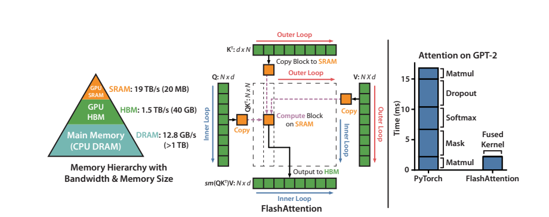
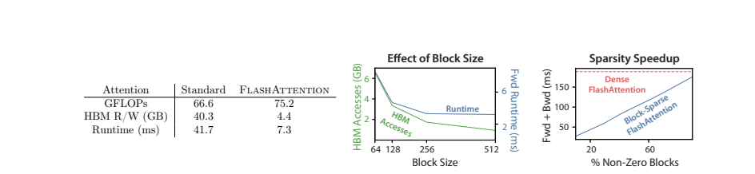
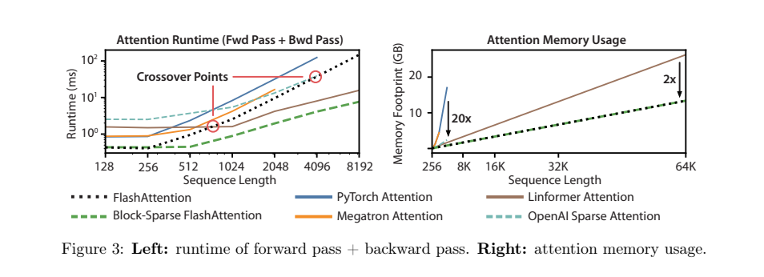
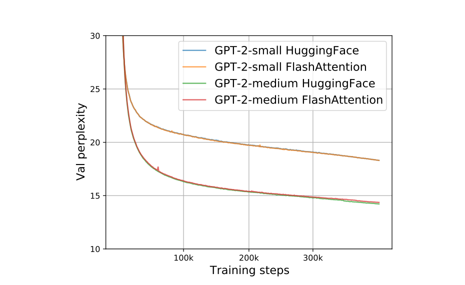
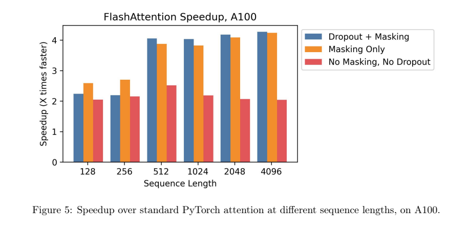
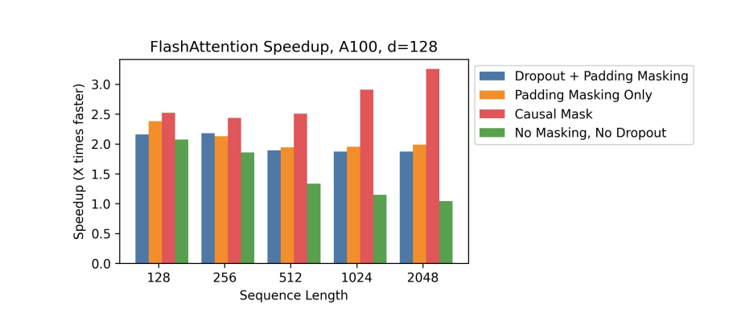
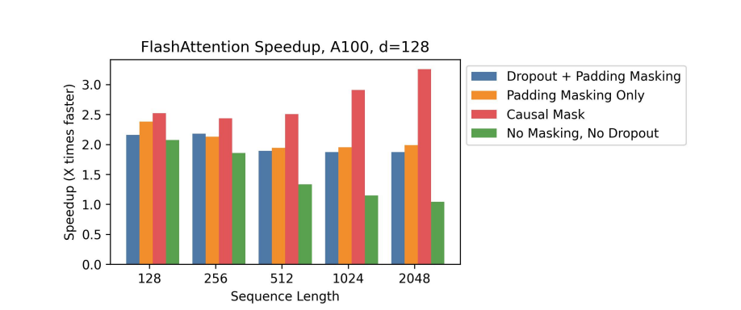
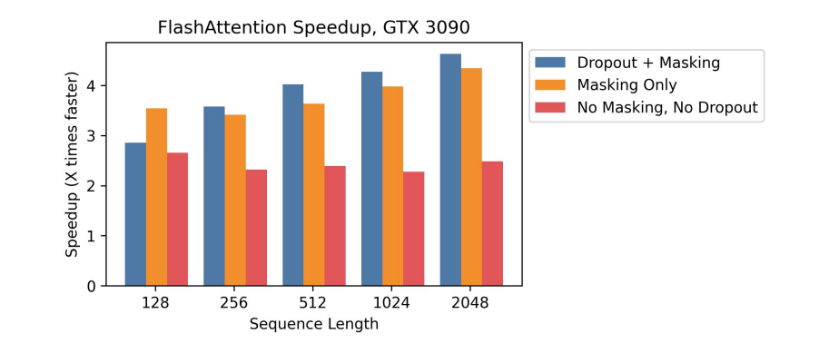

# FlashAttention：具有 IO 感知能力的快速且内存高效的精确注意力机制

**作者：** Tri Dao†, Daniel Y. Fu†, Stefano Ermon†, Atri Rudra‡, and Christopher Ré†

† 斯坦福大学计算机科学系
‡ 纽约州立大学布法罗分校计算机科学与工程系

{trid,danfu}@cs.stanford.edu, ermon@stanford.edu, atri@buffalo.edu, chrismre@cs.stanford.edu

2022年6月24日

## 摘要

Transformer 模型在处理长序列时速度缓慢且内存消耗巨大，因为自注意力的时间和内存复杂度与序列长度呈二次关系。近似注意力方法试图通过牺牲模型质量来降低计算复杂度，但通常无法实现实际运行时间的加速。我们认为，一个缺失的原则是使注意力算法具备 **IO 感知（IO-aware）**——即仔细考虑 GPU 各级内存之间的读写操作。我们提出 **FlashAttention**，一种具备 IO 感知的精确注意力算法，它使用分块（tiling）技术来减少 GPU 高带宽内存（HBM）和 GPU 片上 SRAM 之间的内存读写次数。我们分析了 FlashAttention 的 IO 复杂度，证明它比标准注意力需要更少的 HBM 访问，并且对于一定范围的 SRAM 大小是最优的。我们还将 FlashAttention 扩展到块稀疏注意力，得到一种比任何现有近似注意力方法都更快的近似注意力算法。

FlashAttention 比现有基线方法更快地训练 Transformer：在 BERT-large（序列长度 512）上比 MLPerf 1.1 训练速度记录快 15%，在 GPT-2（序列长度 1K）上实现 3 倍加速，在 Long-Range Arena（序列长度 1K-4K）上实现 2.4 倍加速。FlashAttention 和块稀疏 FlashAttention 使 Transformer 能够处理更长的上下文，产生更高质量的模型（GPT-2 的困惑度改善 0.7，长文档分类提升 6.4 个点），并带来全新的能力：首个在 Path-X 挑战（序列长度 16K，准确率 61.4%）和 Path-256（序列长度 64K，准确率 63.1%）上取得优于随机表现的 Transformer。

## 1 引言

Transformer 模型 [82] 已成为自然语言处理和图像分类等应用中使用最广泛的架构。Transformer 变得越来越大 [5]、越来越深 [83]，但使其具备更长上下文的能力仍然困难 [80]，因为其核心的自注意力模块在时间和内存复杂度上与序列长度呈二次关系。一个重要的问题是：让注意力变得更快、更节省内存是否能够帮助 Transformer 模型应对其在长序列上运行时的运行时间和内存挑战。

许多近似注意力方法旨在降低注意力的计算和内存需求。这些方法包括稀疏近似 [51, 74]、低秩近似 [12, 50, 84] 及其组合 [3, 9, 92]。尽管这些方法将计算需求降低到序列长度的线性或近线性，但许多方法并未表现出相对于标准注意力的实际运行时间加速，因此没有得到广泛采用。一个主要原因是它们专注于减少 FLOP（这可能与实际运行速度不相关），并且往往忽略了内存访问（IO）带来的开销。

在本文中，我们认为一个缺失的原则是使注意力算法具备 **IO 感知（IO-aware）**[1]——即仔细考虑对不同层次快慢内存（例如，快速的 GPU 片上 SRAM 与相对较慢的 GPU 高带宽内存 HBM [45]，见图 1 左）的读写操作。在现代 GPU 上，计算速度已经超过了内存速度 [61, 62, 63]，而 Transformer 中的大多数操作都受内存访问的瓶颈限制 [43]。IO 感知算法对于类似的访存受限操作至关重要，此时读写数据可能占据运行时间的很大一部分——例如数据库连接 [71]、图像处理 [70]、数值线性代数 [4] 等 [40, 85]。然而，常用的深度学习 Python 接口（如 PyTorch 和 TensorFlow）不允许对内存访问进行细粒度控制。

我们提出 **FlashAttention**，一种新的注意力算法，它以更少的内存访问次数计算精确注意力。我们的主要目标是避免从 HBM 读取和写入注意力矩阵。这需要：(i) 在不访问整个输入的情况下计算 softmax 归约；(ii) 不为反向传播存储大型中间注意力矩阵。我们应用两项成熟的技术来应对这些挑战。(i) 我们重构注意力计算，将输入分割成块，并在输入块上进行多次遍历，从而逐步完成 softmax 归约（也称为 tiling）。(ii) 我们保存前向传播的 softmax 归一化因子，以便在反向传播中快速在芯片上重新计算注意力，这比从 HBM 读取中间注意力矩阵的标准方法更快。我们在 CUDA 中实现 FlashAttention，以实现对内存访问的细粒度控制，并将所有注意力操作融合到一个 GPU 核函数中。尽管由于重计算导致 FLOP 增加，但得益于大幅减少的 HBM 访问量，我们的算法运行更快（在 GPT-2 上最高达 7.6 倍加速 [67]，图 1 右）且使用更少的内存——与序列长度呈线性关系——而非标准注意力的二次关系。

**图 1 | 左：** FlashAttention 使用分块技术防止在（相对较慢的）GPU HBM 上物化大型 $N \times N$ 注意力矩阵（虚线框）。在外循环（红色箭头）中，FlashAttention 遍历 K 和 V 矩阵的块，将其加载到快速的片上 SRAM 中。在每个块中，FlashAttention 遍历 Q 矩阵的块（蓝色箭头），将其加载到 SRAM，并将注意力计算的输出写回 HBM。**右：** 相对于 PyTorch 在 GPT-2 上实现的注意力的加速比。FlashAttention 不会将大型 $N \times N$ 注意力矩阵读写到 HBM，从而在注意力计算上实现了 7.6 倍加速。

我们分析了 FlashAttention 的 IO 复杂度 [1]，证明它需要 $O(N^2 d^2 M^{-1})$ 次 HBM 访问，其中 $d$ 是头维度，$M$ 是 SRAM 的大小，而标准注意力需要 $\Omega(Nd + N^2)$ 次。对于 $d$ 和 $M$ 的典型值，FlashAttention 比标准注意力需要少得多的 HBM 访问（最多减少 9 倍，如图 2 所示）。此外，我们提供了一个下界，证明没有任何精确注意力算法能在所有 SRAM 大小上渐进地改善 HBM 访问次数。

我们还证明 FlashAttention 可以作为实现近似注意力算法潜力的有用基础模块，通过克服其内存访问开销问题。作为概念验证，我们实现了块稀疏 FlashAttention，这是一种稀疏注意力算法，比 FlashAttention 快 2-4 倍，可扩展到 64K 的序列长度。我们证明块稀疏 FlashAttention 的 IO 复杂度比 FlashAttention 更好，改进比例与稀疏度成比例。我们将在第 5 节讨论其他操作的进一步扩展（多 GPU 注意力、核回归、块稀疏矩阵乘法）。我们将 FlashAttention 开源，以便更容易地在此基础模块上构建。[^1]

[^1]: FlashAttention 代码可在 https://github.com/HazyResearch/flash-attention 获取。

我们通过实验验证 FlashAttention 加速模型训练并通过建模更长上下文来提升模型质量。我们还对 FlashAttention 和块稀疏 FlashAttention 的运行时间和内存占用进行了基准测试。

- **更快的模型训练。** FlashAttention 在实际时钟时间内更快地训练 Transformer 模型。我们训练 BERT-large（序列长度 512）比 MLPerf 1.1 [58] 的训练速度记录快 15%，训练 GPT-2（序列长度 1K）比 HuggingFace [87] 和 Megatron-LM [77] 的基线实现快 3 倍，训练 Long-Range Arena（序列长度 1K-4K）比基线快 2.4 倍。
- **更高质量的模型。** FlashAttention 使 Transformer 能够扩展到更长的序列，这提高了模型质量并带来了新能力。我们观察到在 GPT-2 上困惑度改善 0.7，在长文档分类 [13] 上通过建模更长序列获得 6.4 个点的提升。FlashAttention 使得首个仅通过使用更长序列长度（16K）就能在 Path-X [80] 挑战上取得优于随机表现的 Transformer 成为可能。块稀疏 FlashAttention 使 Transformer 能够扩展到更长的序列（64K），从而诞生了首个在 Path-256 上取得优于随机表现的模型。
- **注意力基准测试。** FlashAttention 在常见序列长度（128 到 2K）上比标准注意力实现快最多 3 倍，并可扩展到 64K。在序列长度达到 512 之前，FlashAttention 比任何现有注意力方法都更快且更节省内存，而对于超过 1K 的序列长度，一些近似注意力方法（如 Linformer）开始变得更快。另一方面，块稀疏 FlashAttention 比我们所知的所有现有近似注意力方法都更快。

## 2 背景

我们提供一些关于现代硬件（GPU）上常见深度学习操作性能特征的背景知识，并描述注意力的标准实现。

### 2.1 硬件性能

我们主要关注 GPU。其他硬件加速器的性能类似 [46, 48]。

**GPU 内存层次结构。** GPU 内存层次结构（图 1 左）包含多种不同大小和速度的内存形式，较小的内存速度更快。以 A100 GPU 为例，它具有 40-80GB 的高带宽内存（HBM），带宽为 1.5-2.0TB/s，每个流式多处理器（共 108 个）拥有 192KB 的片上 SRAM，估计带宽约为 19TB/s [44, 45]。片上 SRAM 比 HBM 快一个数量级，但容量小多个数量级。随着计算速度相对于内存速度变得越来越快 [61, 62, 63]，操作越来越受内存（HBM）访问的瓶颈限制。因此，利用快速的 SRAM 变得更加重要。

**执行模型。** GPU 拥有大量线程来执行一个操作（称为核函数，kernel）。每个核函数将输入从 HBM 加载到寄存器和 SRAM，进行计算，然后将输出写入 HBM。

**性能特征。** 根据计算和内存访问的平衡，操作可以分为计算受限型或内存受限型。这通常通过**算术强度（arithmetic intensity）**[85] 来衡量，即每字节内存访问的算术操作数。

1. **计算受限型：** 操作所需的时间由算术操作的数量决定，而访问 HBM 的时间则小得多。典型的例子包括大内维度矩阵乘法和具有大量通道数的卷积。
2. **内存受限型：** 操作所需的时间由内存访问次数决定，而计算所花费的时间则小得多。例子包括大多数其他操作：逐元素操作（如激活、dropout）和归约操作（如 sum、softmax、batch norm、layer norm）。

**核函数融合。** 加速内存受限操作的最常见方法是核函数融合：如果对同一个输入应用多个操作，该输入可以从 HBM 加载一次，而不是为每个操作多次加载。编译器可以自动融合许多逐元素操作 [53, 65, 75]。然而，在模型训练的上下文中，中间值仍然需要写入 HBM 以保存用于反向传播，这降低了朴素核函数融合的效果。

### 2.2 标准注意力实现

给定输入序列 $\mathbf{Q}, \mathbf{K}, \mathbf{V} \in \mathbb{R}^{N \times d}$，其中 $N$ 是序列长度，$d$ 是头维度，我们需要计算注意力输出 $\mathbf{O} \in \mathbb{R}^{N \times d}$：

$$\mathbf{S} = \mathbf{Q}\mathbf{K}^\top \in \mathbb{R}^{N \times N}, \quad \mathbf{P} = \text{softmax}(\mathbf{S}) \in \mathbb{R}^{N \times N}, \quad \mathbf{O} = \mathbf{P}\mathbf{V} \in \mathbb{R}^{N \times d}$$

其中 softmax 按行应用。

标准注意力实现将矩阵 $\mathbf{S}$ 和 $\mathbf{P}$ 物化到 HBM，这需要 $O(N^2)$ 内存。通常 $N \gg d$（例如，对于 GPT-2，$N = 1024$ 且 $d = 64$）。我们在算法 0 中描述了标准注意力实现。由于部分或大多数操作是内存受限的（如 softmax），大量的内存访问转化为缓慢的实际时钟时间。

这个问题因应用于注意力矩阵的其他逐元素操作而加剧，例如应用于 $\mathbf{S}$ 的掩码操作或应用于 $\mathbf{P}$ 的 dropout 操作。因此，已有许多尝试融合多个逐元素操作，例如将掩码与 softmax 融合 [77]。

在第 3.2 节，我们将证明标准注意力实现执行的 HBM 访问与序列长度 $N$ 成二次关系。我们还将比较标准注意力和我们的方法（FlashAttention）的 FLOP 数和 HBM 访问次数。

**算法 0：标准注意力实现**

**输入：** 矩阵 $\mathbf{Q}, \mathbf{K}, \mathbf{V} \in \mathbb{R}^{N \times d}$ 位于 HBM 中。

1: 按块从 HBM 加载 $\mathbf{Q}, \mathbf{K}$，计算 $\mathbf{S} = \mathbf{Q}\mathbf{K}^\top$，将 $\mathbf{S}$ 写入 HBM。

2: 从 HBM 读取 $\mathbf{S}$，计算 $\mathbf{P} = \text{softmax}(\mathbf{S})$，将 $\mathbf{P}$ 写入 HBM。

3: 按块从 HBM 加载 $\mathbf{P}$ 和 $\mathbf{V}$，计算 $\mathbf{O} = \mathbf{P}\mathbf{V}$，将 $\mathbf{O}$ 写入 HBM。

4: **返回** $\mathbf{O}$。

**算法 1：FlashAttention**

**输入：** 矩阵 $\mathbf{Q}, \mathbf{K}, \mathbf{V} \in \mathbb{R}^{N \times d}$ 位于 HBM 中，片上 SRAM 大小为 $M$。

1: 设置块大小 $B_c = \left\lceil \frac{M}{4d} \right\rceil, B_r = \min\left(\left\lceil \frac{M}{4d} \right\rceil, d\right)$。

2: 在 HBM 中初始化 $\mathbf{O} = (0)_{N \times d} \in \mathbb{R}^{N \times d}, \ell = (0)_N \in \mathbb{R}^N, m = (-\infty)_N \in \mathbb{R}^N$。

3: 将 $\mathbf{Q}$ 划分为 $T_r = \left\lceil \frac{N}{B_r} \right\rceil$ 个块 $\mathbf{Q}_1, \ldots, \mathbf{Q}_{T_r}$，每个大小为 $B_r \times d$；将 $\mathbf{K}, \mathbf{V}$ 划分为 $T_c = \left\lceil \frac{N}{B_c} \right\rceil$ 个块 $\mathbf{K}_1, \ldots, \mathbf{K}_{T_c}$ 和 $\mathbf{V}_1, \ldots, \mathbf{V}_{T_c}$，每个大小为 $B_c \times d$。

4: 将 $\mathbf{O}$ 划分为 $T_r$ 个块 $\mathbf{O}_i, \ldots, \mathbf{O}_{T_r}$，每个大小为 $B_r \times d$；将 $\ell$ 划分为 $T_r$ 个块 $\ell_i, \ldots, \ell_{T_r}$，每个大小为 $B_r$；将 $m$ 划分为 $T_r$ 个块 $m_1, \ldots, m_{T_r}$，每个大小为 $B_r$。

5: **for** $1 \leq j \leq T_c$ **do**

6: &emsp; 将 $\mathbf{K}_j, \mathbf{V}_j$ 从 HBM 加载到片上 SRAM。

7: &emsp; **for** $1 \leq i \leq T_r$ **do**

8: &emsp;&emsp; 将 $\mathbf{Q}_i, \mathbf{O}_i, \ell_i, m_i$ 从 HBM 加载到片上 SRAM。

9: &emsp;&emsp; 在芯片上计算 $\mathbf{S}_{ij} = \mathbf{Q}_i \mathbf{K}_j^\top \in \mathbb{R}^{B_r \times B_c}$。

10: &emsp;&emsp; 在芯片上计算 $\tilde{m}_{ij} = \text{rowmax}(\mathbf{S}_{ij}) \in \mathbb{R}^{B_r}, \tilde{\mathbf{P}}_{ij} = \exp(\mathbf{S}_{ij} - \tilde{m}_{ij}) \in \mathbb{R}^{B_r \times B_c}$（逐点），$\tilde{\ell}_{ij} = \text{rowsum}(\tilde{\mathbf{P}}_{ij}) \in \mathbb{R}^{B_r}$。

11: &emsp;&emsp; 在芯片上计算 $m^{\text{new}}_i = \max(m_i, \tilde{m}_{ij}) \in \mathbb{R}^{B_r}, \ell^{\text{new}}_i = e^{m_i - m^{\text{new}}_i} \ell_i + e^{\tilde{m}_{ij} - m^{\text{new}}_i} \tilde{\ell}_{ij} \in \mathbb{R}^{B_r}$。

12: &emsp;&emsp; 将 $\mathbf{O}_i \leftarrow \text{diag}(\ell^{\text{new}}_i)^{-1} \left( \text{diag}(\ell_i) e^{m_i - m^{\text{new}}_i} \mathbf{O}_i + e^{\tilde{m}_{ij} - m^{\text{new}}_i} \tilde{\mathbf{P}}_{ij} \mathbf{V}_j \right)$ 写入 HBM。

13: &emsp;&emsp; 将 $\ell_i \leftarrow \ell^{\text{new}}_i, m_i \leftarrow m^{\text{new}}_i$ 写入 HBM。

14: &emsp; **end for**

15: **end for**

16: **返回** $\mathbf{O}$。

我们展示 FlashAttention 的正确性、运行时间和内存需求（证明见附录 C）。

**定理 1.** 算法 1 返回 $\mathbf{O} = \text{softmax}(\mathbf{Q}\mathbf{K}^\top)\mathbf{V}$，需要 $O(N^2 d)$ FLOP，并且除输入和输出外仅需 $O(N)$ 额外内存。

### 3.2 分析：FlashAttention 的 IO 复杂度

我们分析 FlashAttention 的 IO 复杂度，证明相比标准注意力显著减少了 HBM 访问。我们还提供了一个下界，证明没有任何精确注意力算法能在所有 SRAM 大小上渐进地改善 HBM 访问。证明见附录 C。

**定理 2.** 设 $N$ 为序列长度，$d$ 为头维度，$M$ 为 SRAM 大小，且 $d \leq M \leq Nd$。标准注意力（算法 0）需要 $\Theta(Nd + N^2)$ 次 HBM 访问，而 FlashAttention（算法 1）需要 $\Theta(N^2 d^2 M^{-1})$ 次 HBM 访问。

对于 $d$（64-128）和 $M$（约 100KB）的典型值，$d^2$ 比 $M$ 小很多倍，因此 FlashAttention 比标准实现需要少得多的 HBM 访问。这同时带来了更快的执行速度和更低的内存占用，我们将在第 4.3 节验证这一点。

证明的主要思想是，给定 SRAM 大小 $M$，我们可以加载大小为 $\Theta(M)$ 的 $\mathbf{K}, \mathbf{V}$ 块（算法 1 第 6 行）。对于每个 $\mathbf{K}$ 和 $\mathbf{V}$ 的块，我们遍历所有 $\mathbf{Q}$ 的块（算法 1 第 8 行）来计算中间值，这导致对 $\mathbf{Q}$ 进行 $\Theta(Nd M^{-1})$ 次遍历。每次遍历加载 $\Theta(Nd)$ 个元素，总计 $\Theta(N^2 d^2 M^{-1})$ 次 HBM 访问。我们类似地证明标准注意力的反向传播需要 $\Theta(Nd + N^2)$ 次 HBM 访问，而 FlashAttention 的反向传播需要 $\Theta(N^2 d^2 M^{-1})$ 次 HBM 访问（附录 B）。

我们证明了一个下界：在计算精确注意力时，无法对所有 $M$（SRAM 大小）值渐进地改善 HBM 访问次数。

**命题 3.** 设 $N$ 为序列长度，$d$ 为头维度，$M$ 为 SRAM 大小，且 $d \leq M \leq Nd$。不存在一种算法，对于 $[d, Nd]$ 范围内的所有 $M$，计算精确注意力所需的 HBM 访问次数为 $o(N^2 d^2 M^{-1})$。

该证明依赖于以下事实：当 $M = \Theta(Nd)$ 时，任何算法必须执行 $\Omega(N^2 d^2 M^{-1}) = \Omega(Nd)$ 次 HBM 访问。这种在 $M$ 的子范围上的下界类型在流算法文献中很常见 [88]。我们将证明关于 $M$ 的参数化复杂度 [27] 下界留作令人兴奋的未来工作。

我们验证了 HBM 访问次数是注意力运行时间的主要决定因素。在图 2（左）中，我们看到尽管 FlashAttention 相比标准注意力具有更高的 FLOP 计数（由于反向传播中的重计算），但它的 HBM 访问次数少得多，从而实现了更快的运行时间。在图 2（中）中，我们改变 FlashAttention 的块大小 $B_c$，这导致不同数量的 HBM 访问，并测量前向传播的运行时间。随着块大小的增加，HBM 访问次数减少（因为我们对输入进行更少的遍历），运行时间也减少。对于足够大的块大小（超过 256），运行时间则受其他因素（如算术操作）瓶颈限制。此外，更大的块大小将无法放入小型 SRAM 中。

**图 2 | 左：** 标准注意力和 FlashAttention 在 GPT-2 medium（序列长度 1024，头维度 64，16 个头，批量大小 64）上前向+反向运行时间（A100 GPU）。HBM 访问是影响运行时间的主要因素。**中：** FlashAttention 在不同块大小下的前向运行时间。更少的 HBM 访问带来更快的运行时间，直到某个临界点。**右：** 块稀疏 FlashAttention 的运行时间（序列长度 4K）比 FlashAttention 更快，加速比与稀疏度成比例。

### 3.3 扩展：块稀疏 FlashAttention

我们将 FlashAttention 扩展到近似注意力：我们提出块稀疏 FlashAttention，其 IO 复杂度比 FlashAttention 小，减小比例与稀疏度成比例。

给定输入 $\mathbf{Q}, \mathbf{K}, \mathbf{V} \in \mathbb{R}^{N \times d}$ 和一个掩码矩阵 $\tilde{\mathbf{M}} \in \{0, 1\}^{N \times N}$，我们需要计算：

$$\mathbf{S} = \mathbf{Q}\mathbf{K}^\top \in \mathbb{R}^{N \times N}, \quad \mathbf{P} = \text{softmax}(\mathbf{S} \odot \mathbb{1}_{\tilde{\mathbf{M}}}) \in \mathbb{R}^{N \times N}, \quad \mathbf{O} = \mathbf{P}\mathbf{V} \in \mathbb{R}^{N \times d}$$

其中 $(\mathbf{S} \odot \mathbb{1}_{\tilde{\mathbf{M}}})_{kl} = \mathbf{S}_{kl}$（如果 $\tilde{\mathbf{M}}_{kl} = 1$），否则为 $-\infty$（如果 $\mathbf{M}_{kl} = 0$）。我们要求 $\tilde{\mathbf{M}}$ 具有块形式：对于某些块大小 $B_r, B_c$，对所有 $k, l$，$\tilde{\mathbf{M}}_{k, l} = \mathbf{M}_{ij}$，其中 $i = \lfloor k / B_r \rfloor, j = \lfloor l / B_c \rfloor$，且 $\mathbf{M} \in \{0, 1\}^{N/B_r \times N/B_c}$。

给定预定义的块稀疏掩码 $\mathbf{M} \in \{0, 1\}^{N/B_r \times N/B_c}$，我们可以轻松地调整算法 1 来仅计算注意力矩阵的非零块。该算法与算法 1 相同，只是我们跳过零块。我们在附录 B 的算法 5 中复现了算法描述。

我们还分析了块稀疏 FlashAttention 的 IO 复杂度。

**命题 4.** 设 $N$ 为序列长度，$d$ 为头维度，$M$ 为 SRAM 大小，且 $d \leq M \leq Nd$。块稀疏 FlashAttention（算法 5）需要 $\Theta(Nd + N^2 d^2 M^{-1} s)$ 次 HBM 访问，其中 $s$ 是块稀疏掩码中非零块的比例。

我们看到应用块稀疏性使 IO 复杂度中较大项按稀疏度直接改善。对于大序列长度 $N$，$s$ 通常设置为 $N^{-1/2}$ [11] 或 $N^{-1} \log N$ [3, 17, 92]，从而产生 $\Theta(N \sqrt{N})$ 或 $\Theta(N \log N)$ 的 IO 复杂度。对于下游实验，我们使用固定的蝴蝶稀疏模式 [17]，该模式已被证明能够近似任意稀疏性 [16]。

在图 2（右）中，我们验证了随着稀疏度增加，块稀疏 FlashAttention 的运行时间成比例地改善。在 LRA 基准测试上，块稀疏 FlashAttention 实现了 2.8 倍加速，同时表现与标准注意力相当（第 4 节）。

## 4 实验

我们评估使用 FlashAttention 训练 Transformer 模型的影响。我们验证关于训练时间和模型准确率的两个主张，并报告注意力运行时间和内存基准测试。

- **训练速度。** FlashAttention 在 BERT 上比 MLPerf 1.1 [58] 的速度记录快 15%，在 GPT-2 上比 HuggingFace [87] 快最多 3 倍、比 Megatron [77] 快 1.8 倍。FlashAttention 在 Long-Range Arena（LRA）基准测试上加速 2.4 倍。
- **质量。** FlashAttention 使 Transformer 能够扩展到更长的序列，产生更高的质量。FlashAttention 用 4K 上下文长度训练 GPT-2 比 Megatron 用 1K 上下文长度训练更快，同时实现 0.7 更好的困惑度。建模更长序列在两个长文档分类任务上带来 6.4 个点的提升。最后，FlashAttention 产生了首个在挑战性的 Path-X 任务（序列长度 16K）上取得优于随机表现的 Transformer，块稀疏 FlashAttention 产生了我们所知的首个在 Path-256（序列长度 64K）上取得优于随机表现的序列模型。
- **注意力基准测试。** 我们测量 FlashAttention 和块稀疏 FlashAttention 基于序列长度的运行时间和内存性能。我们确认 FlashAttention 的内存占用随序列长度线性增长，并且在常见序列长度（最多 2K）上比标准注意力快最多 3 倍。我们确认块稀疏 FlashAttention 的运行时间随序列长度线性增长，并且比所有现有近似注意力基线更快。

更多实验细节见附录 E。

### 4.1 使用 FlashAttention 获得更快的模型

**BERT。** FlashAttention 实现了我们所知的最快单节点 BERT 训练速度。我们使用 FlashAttention 在 Wikipedia 上训练 BERT-large [22] 模型。表 1 将我们的训练时间与 Nvidia 为 MLPerf 1.1 [58] 创下训练速度记录的实现进行了比较。我们的实现快 15%。

**表 1：BERT-large 的训练时间**，从 MLPerf 基准提供的相同初始化开始，达到掩码语言建模目标准确率 72.0%。在 8 × A100 GPU 上取 10 次运行的平均值。

| BERT 实现 | 训练时间（分钟） |
|-----------|----------------|
| Nvidia MLPerf 1.1 [58] | 20.0 ± 1.5 |
| FlashAttention（本文） | 17.4 ± 1.4 |

**GPT-2。** FlashAttention 在大型 OpenWebtext 数据集 [32] 上比广泛使用的 HuggingFace [87] 和 Megatron-LM [77] 实现实现了更快的 GPT-2 [67] 训练时间。表 2 显示相对于 HuggingFace 最多 3 倍的端到端加速，以及相对于 Megatron-LM 最多 1.7 倍的加速。FlashAttention 实现了与其他两种实现相同的困惑度，因为我们没有改变模型定义。附录 E 包含了训练过程中验证困惑度的图表，确认 FlashAttention 与基线具有相同的数值稳定性，并且产生相同的训练/验证曲线。

**表 2：使用 FlashAttention 的 GPT-2 small 和 medium**，相比 HuggingFace 实现实现最多 3 倍加速，相比 Megatron-LM 实现最多 1.7 倍加速。训练时间在 8 × A100 GPU 上报告。

| 模型实现 | OpenWebText (ppl) | 训练时间（加速比） |
|---------|-------------------|------------------|
| GPT-2 small - Huggingface [87] | 18.2 | 9.5 天 (1.0×) |
| GPT-2 small - Megatron-LM [77] | 18.2 | 4.7 天 (2.0×) |
| GPT-2 small - FlashAttention | 18.2 | 2.7 天 (3.5×) |
| GPT-2 medium - Huggingface [87] | 14.2 | 21.0 天 (1.0×) |
| GPT-2 medium - Megatron-LM [77] | 14.3 | 11.5 天 (1.8×) |
| GPT-2 medium - FlashAttention | 14.3 | 6.9 天 (3.0×) |

**Long-Range Arena。** 我们比较了在 Long-Range Arena（LRA [80]）基准测试上使用标准实现和 FlashAttention 的 vanilla Transformer。我们测量所有模型的准确率、吞吐量和训练时间。每个任务具有不同的序列长度，在 1024 和 4096 之间变化。我们遵循 Tay 等人 [80] 和 Xiong 等人 [90] 的实现和实验设置。[^3] 表 3 显示 FlashAttention 相比标准注意力实现最多 2.4 倍加速。块稀疏 FlashAttention 比我们测试过的所有近似注意力方法都更快。

[^3]: LRA 准确率结果已知高度依赖于调参过程 [90]。我们复现的基线表现优于原始比较 [80] 中报告的结果。

**表 3：标准注意力、FlashAttention、块稀疏 FlashAttention 和近似注意力基线在 Long-Range-Arena 基准上的表现。**

| 模型 | ListOps | Text | Retrieval | Image | Pathfinder | 平均 | 加速比 |
|------|---------|------|-----------|-------|-----------|------|--------|
| Transformer | 36.0 | 63.6 | 81.6 | 42.3 | 72.7 | 59.3 | - |
| FlashAttention | 37.6 | 63.9 | 81.4 | 43.5 | 72.7 | 59.8 | 2.4× |
| Block-sparse FlashAttention | 37.0 | 63.0 | 81.3 | 43.6 | 73.3 | 59.6 | 2.8× |
| Linformer [84] | 35.6 | 55.9 | 77.7 | 37.8 | 67.6 | 54.9 | 2.5× |
| Linear Attention [50] | 38.8 | 63.2 | 80.7 | 42.6 | 72.5 | 59.6 | 2.3× |
| Performer [12] | 36.8 | 63.6 | 82.2 | 42.1 | 69.9 | 58.9 | 1.8× |
| Local Attention [80] | 36.1 | 60.2 | 76.7 | 40.6 | 66.6 | 56.0 | 1.7× |
| Reformer [51] | 36.5 | 63.8 | 78.5 | 39.6 | 69.4 | 57.6 | 1.3× |
| Smyrf [19] | 36.1 | 64.1 | 79.0 | 39.6 | 70.5 | 57.9 | 1.7× |

### 4.2 使用更长序列获得更好的模型

**使用长上下文的语言建模。** FlashAttention 的运行时间和内存效率使我们能够将 GPT-2 的上下文长度增加 4 倍，同时仍比 Megatron-LM 的优化实现运行更快。表 4 显示使用 FlashAttention 且上下文长度为 4K 的 GPT-2 仍比 Megatron 上下文长度 1K 的 GPT-2 快 30%，同时实现 0.7 更好的困惑度。

**表 4：使用 FlashAttention 的 GPT-2 small，相比 Megatron-LM 具有 4 倍更大的上下文长度，仍快 30%，困惑度好 0.7。** 训练时间在 8 × A100 GPU 上报告。

| 模型实现 | 上下文长度 | OpenWebText (ppl) | 训练时间（加速比） |
|---------|-----------|-------------------|------------------|
| GPT-2 small - Megatron-LM | 1k | 18.2 | 4.7 天 (1.0×) |
| GPT-2 small - FlashAttention | 1k | 18.2 | 2.7 天 (1.7×) |
| GPT-2 small - FlashAttention | 2k | 17.6 | 3.0 天 (1.6×) |
| GPT-2 small - FlashAttention | 4k | 17.5 | 3.6 天 (1.3×) |

**长文档分类。** 使用 FlashAttention 训练更长序列的 Transformer 提高了在 MIMIC-III [47] 和 ECtHR [6, 7] 数据集上的表现。MIMIC-III 包含重症监护室患者的出院小结，每份标注有多个标签。ECtHR 包含来自欧洲人权法院的法律案例，每个案例映射到据称被违反的人权公约条款。这两个数据集都包含非常长的文本文档；MIMIC 的平均令牌数为 2,395 个令牌，最长文档包含 14,562 个令牌，而 ECtHR 的平均和最长令牌数分别为 2,197 和 49,392。我们评估从增加预训练 RoBERTa 模型 [56] 的序列长度中获得的提升（我们重复位置嵌入，如 Beltagy 等人 [3] 所述）。

表 5 显示序列长度 16K 在 MIMIC 上比长度 512 高出 4.3 个点，长度 8K 在 ECtHR 上比长度 512 高出 8.5 个点。差异可能是由于微妙的分布偏移：MIMIC-III 包含专门的医学文本，因此可能更容易受到文档长度分布偏移的影响，而 ECtHR 包含一般语言。

**表 5：使用 FlashAttention 在不同序列长度下的长文档表现（micro F1）。**

| 数据集 | 512 | 1024 | 2048 | 4096 | 8192 | 16384 |
|--------|-----|------|------|------|------|-------|
| MIMIC-III [47] | 52.8 | 50.7 | 51.7 | 54.6 | 56.4 | 57.1 |
| ECtHR [6] | 72.2 | 74.3 | 77.1 | 78.6 | 80.7 | 79.2 |

**Path-X 和 Path-256。** Path-X 和 Path-256 基准测试是 Long-Range Arena 基准中旨在测试长上下文的挑战性任务。任务是对黑白 128×128（或 256×256）图像中的两个点是否有路径连接进行分类，图像每次一个像素地输入 Transformer。在先前的工作中，所有 Transformer 模型要么内存耗尽，要么仅取得了随机表现 [80]。已有寻找能够建模如此长上下文的替代架构的探索 [37]。我们在此呈现 Transformer 模型能够解决 Path-X 和 Path-256 的首个结果（表 6）。我们在 Path-64 上预训练一个 Transformer，然后通过空间插值位置嵌入来迁移到 Path-X。FlashAttention 在 Path-X 上实现了 61.4 的准确率。此外，块稀疏 FlashAttention 使 Transformer 能够扩展到 64K 的序列长度，在 Path-256 上实现 63.1 的准确率[^4]。

[^4]: Path-256 需要更长的序列，但具有相对较短的路径，因此更容易获得更高的准确率。

**表 6：我们报告了首个能够在 Path-X 和 Path-256 上实现非随机表现的 Transformer 模型。**

| 模型 | Path-X | Path-256 |
|------|--------|----------|
| Transformer | ✗ | ✗ |
| Linformer [84] | ✗ | ✗ |
| Linear Attention [50] | ✗ | ✗ |
| Performer [12] | ✗ | ✗ |
| Local Attention [80] | ✗ | ✗ |
| Reformer [51] | ✗ | ✗ |
| SMYRF [19] | ✗ | ✗ |
| FlashAttention | 61.4 | ✗ |
| Block-sparse FlashAttention | 56.0 | 63.1 |

### 4.3 注意力基准测试

我们改变序列长度，并在具有 40 GB HBM 的单个 A100 GPU 上测量 FlashAttention 和块稀疏 FlashAttention 相对于各种注意力基线的运行时间和内存使用，使用 dropout 和填充掩码。我们比较精确注意力、近似注意力和稀疏注意力的参考实现。我们在正文中报告部分基线；附录 E 包含更多基线和完整细节。

**图 3 | 左：** 前向传播 + 反向传播的运行时间。**右：** 注意力内存使用。

**运行时间。** 图 3（左）报告了 FlashAttention 和块稀疏 FlashAttention 与精确、近似和稀疏注意力基线的前向+反向传播运行时间（毫秒）（具体数字见附录 E）。运行时间随序列长度呈二次增长，但 FlashAttention 明显快于精确注意力基线，比 PyTorch 实现快最多 3 倍。许多近似/稀疏注意力机制的运行时间随序列长度线性增长，但 FlashAttention 对于短序列由于更少的内存访问仍比近似和稀疏注意力更快。近似注意力的运行时间在序列长度 512 到 1024 之间开始与 FlashAttention 交叉。另一方面，块稀疏 FlashAttention 在所有序列长度上都比所有我们已知的精确、稀疏和近似注意力实现更快。

**内存占用。** 图 3（右）显示了 FlashAttention 和块稀疏 FlashAttention 与各种精确、近似和稀疏注意力基线相比的内存占用。FlashAttention 和块稀疏 FlashAttention 具有相同的内存占用，随序列长度线性增长。FlashAttention 比精确注意力基线节省最多 20 倍内存，并且比近似注意力基线更节省内存。除 Linformer 外的所有其他算法在 64K 之前都在 A100 GPU 上耗尽内存，而 FlashAttention 仍比 Linformer 高效 2 倍。

## 5 局限与未来方向

我们讨论方法的局限性和未来方向。相关工作在附录 A 中给出。

**编译到 CUDA。** 我们当前构建 IO 感知注意力实现的方法需要为每个新的注意力实现编写一个新的 CUDA 核函数。这需要用比 PyTorch 低得多的语言编写注意力算法，并且需要大量工程工作。实现也可能无法跨 GPU 架构移植。这些局限性表明需要一种方法，支持用高级语言（如 PyTorch）编写注意力算法，并编译为 CUDA 中的 IO 感知实现——类似于图像处理中 Halide 的努力 [70]。

**IO 感知深度学习。** 我们相信 IO 感知的方法可以超越注意力。注意力是 Transformer 中内存最密集的计算，但深度网络中的每一层都会触及 GPU HBM。我们希望我们的工作能够启发其他模块的 IO 感知实现。我们在附录 D 中讨论这些潜在的扩展。

**多 GPU IO 感知方法。** 我们的 IO 感知注意力实现在单个 GPU 上计算注意力的常数因子内是最优的。然而，注意力计算可能可以在多个 GPU 上并行化 [72]。使用多个 GPU 为 IO 分析增加了额外的一层——需要考虑 GPU 之间的数据传输。我们希望我们的工作能启发未来在这个方向上的工作。

## 致谢

我们的实现使用 Apex 的 FMHA 代码（https://github.com/NVIDIA/apex/tree/master/apex/contrib/csrc/fmha）作为起点。我们感谢 Young-Jun Ko 对其 FMHA 实现的深入解释以及对我们关于 CUDA 问题的周到回答。我们感谢 Sabri Eyuboglu、Megan Leszczynski、Laurel Orr、Yuhuai Wu、Beidi Chen 和 Xun Huang 对论文早期草稿的建设性反馈和建议。我们感谢 Markus Rabe 和 Charles Staats 关于他们注意力算法的有益讨论。

我们衷心感谢 NIH（No. U54EB020405, Mobilize）、NSF（Nos. CCF1763315, Beyond Sparsity; CCF1563078, Volume to Velocity; 1937301, RTML）、ARL（No. W911NF-21-2-0251, Interactive Human-AI Teaming）、ONR（No. N000141712266, Unifying Weak Supervision; ONR N00014-20-1-2480: Understanding and Applying Non-Euclidean Geometry in Machine Learning; N000142012275, NEPTUNE）、NXP、Xilinx、LETI-CEA、Intel、IBM、Microsoft、NEC、Toshiba、TSMC、ARM、Hitachi、BASF、Accenture、Ericsson、Qualcomm、Analog Devices、Google Cloud、Salesforce、Total、HAI-GCP 和 HAI-Azure Cloud Credits for Research 项目、斯坦福数据科学计划（SDSI）、国防部通过国防科学与工程研究生奖学金（NDSEG）计划以及斯坦福 DAWN 项目成员（Facebook、Google 和 VMWare）的支持。美国政府被授权为政府目的复制和分发重印件，不受任何版权声明的影响。本文中表达的任何意见、发现、结论或建议均为作者的观点，不一定反映 NIH、ONR 或美国政府的观点、政策或背书（明示或暗示）。Atri Rudra 的研究由 NSF 资助 CCF-1763481 支持。

## 参考文献

[1] Alok Aggarwal and S Vitter, Jeffrey. The input/output complexity of sorting and related problems. *Communications of the ACM*, 31(9):1116–1127, 1988.

[2] Irwan Bello. LambdaNetworks: Modeling long-range interactions without attention. *arXiv preprint arXiv:2102.08602*, 2021.

[3] Iz Beltagy, Matthew E Peters, and Arman Cohan. Longformer: The long-document transformer. *arXiv preprint arXiv:2004.05150*, 2020.

[4] L Susan Blackford, Antoine Petitet, Roldan Pozo, Karin Remington, R Clint Whaley, James Demmel, Jack Dongarra, Iain Duff, Sven Hammarling, Greg Henry, et al. An updated set of basic linear algebra subprograms (BLAS). *ACM Transactions on Mathematical Software*, 28(2):135–151, 2002.

[5] Tom Brown, Benjamin Mann, Nick Ryder, Melanie Subbiah, Jared D Kaplan, Prafulla Dhariwal, Arvind Neelakantan, Pranav Shyam, Girish Sastry, Amanda Askell, et al. Language models are few-shot learners. *Advances in Neural Information Processing Systems*, 33:1877–1901, 2020.

[6] Ilias Chalkidis, Ion Androutsopoulos, and Nikolaos Aletras. Neural legal judgment prediction in English. In *Proceedings of the 57th Annual Meeting of the Association for Computational Linguistics*, pages 4317–4323, Florence, Italy, 2019. Association for Computational Linguistics. doi: 10.18653/v1/P19-1424. URL https://www.aclweb.org/anthology/P19-1424.

[7] Ilias Chalkidis, Manos Fergadiotis, Dimitrios Tsarapatsanis, Nikolaos Aletras, Ion Androutsopoulos, and Prodromos Malakasiotis. Paragraph-level rationale extraction through regularization: A case study on European court of human rights cases. In *Proceedings of the Annual Conference of the North American Chapter of the Association for Computational Linguistics*, Mexico City, Mexico, 2021. Association for Computational Linguistics.

[8] Benjamin Charlier, Jean Feydy, Joan Alexis Glaunès, François-David Collin, and Ghislain Durif. Kernel operations on the GPU, with autodiff, without memory overflows. *Journal of Machine Learning Research*, 22(74):1–6, 2021. URL http://jmlr.org/papers/v22/20-275.html.

[9] Beidi Chen, Tri Dao, Eric Winsor, Zhao Song, Atri Rudra, and Christopher Ré. Scatterbrain: Unifying sparse and low-rank attention. In *Advances in Neural Information Processing Systems (NeurIPS)*, 2021.

[10] Tianqi Chen, Bing Xu, Chiyuan Zhang, and Carlos Guestrin. Training deep nets with sublinear memory cost. *arXiv preprint arXiv:1604.06174*, 2016.

[11] Rewon Child, Scott Gray, Alec Radford, and Ilya Sutskever. Generating long sequences with sparse transformers. *arXiv preprint arXiv:1904.10509*, 2019.

[12] Krzysztof Marcin Choromanski, Valerii Likhosherstov, David Dohan, Xingyou Song, Andreea Gane, Tamas Sarlos, Peter Hawkins, Jared Quincy Davis, Afroz Mohiuddin, Lukasz Kaiser, et al. Rethinking attention with performers. In *International Conference on Learning Representations (ICLR)*, 2020.

[13] Xiang Dai, Ilias Chalkidis, Sune Darkner, and Desmond Elliott. Revisiting transformer-based models for long document classification. *arXiv preprint arXiv:2204.06683*, 2022.

[14] Zihang Dai, Zhilin Yang, Yiming Yang, Jaime G Carbonell, Quoc Le, and Ruslan Salakhutdinov. Transformer-XL: Attentive language models beyond a fixed-length context. In *Proceedings of the 57th Annual Meeting of the Association for Computational Linguistics*, pages 2978–2988, 2019.

[15] Tri Dao, Albert Gu, Matthew Eichhorn, Atri Rudra, and Christopher Ré. Learning fast algorithms for linear transforms using butterfly factorizations. In *International Conference on Machine Learning (ICML)*, 2019.

[16] Tri Dao, Nimit Sohoni, Albert Gu, Matthew Eichhorn, Amit Blonder, Megan Leszczynski, Atri Rudra, and Christopher Ré. Kaleidoscope: An efficient, learnable representation for all structured linear maps. In *International Conference on Learning Representations (ICLR)*, 2020.

[17] Tri Dao, Beidi Chen, Kaizhao Liang, Jiaming Yang, Zhao Song, Atri Rudra, and Christopher Ré. Pixelated butterfly: Simple and efficient sparse training for neural network models. In *International Conference on Learning Representations (ICLR)*, 2022.

[18] Tri Dao, Beidi Chen, Nimit Sohoni, Arjun Desai, Michael Poli, Jessica Grogan, Alexander Liu, Aniruddh Rao, Atri Rudra, and Christopher Ré. Monarch: Expressive structured matrices for efficient and accurate training. In *International Conference on Machine Learning (ICML)*, 2022.

[19] Giannis Daras, Nikita Kitaev, Augustus Odena, and Alexandros G Dimakis. Smyrf-efficient attention using asymmetric clustering. *Advances in Neural Information Processing Systems*, 33:6476–6489, 2020.

[20] Christopher De Sa, Albert Gu, Rohan Puttagunta, Christopher Ré, and Atri Rudra. A two-pronged progress in structured dense matrix vector multiplication. In *Proceedings of the Twenty-Ninth Annual ACM-SIAM Symposium on Discrete Algorithms*, pages 1060–1079. SIAM, 2018.

[21] Peter J Denning. The working set model for program behavior. *Communications of the ACM*, 11(5):323–333, 1968.

[22] Jacob Devlin, Ming-Wei Chang, Kenton Lee, and Kristina Toutanova. BERT: Pre-training of deep bidirectional transformers for language understanding. 2019.

[23] Xin Dong, Shangyu Chen, and Sinno Jialin Pan. Learning to prune deep neural networks via layer-wise optimal brain surgeon. *arXiv preprint arXiv:1705.07565*, 2017.

[24] Alexey Dosovitskiy, Lucas Beyer, Alexander Kolesnikov, Dirk Weissenborn, Xiaohua Zhai, Thomas Unterthiner, Mostafa Dehghani, Matthias Minderer, Georg Heigold, Sylvain Gelly, et al. An image is worth 16x16 words: Transformers for image recognition at scale. In *International Conference on Learning Representations*, 2020.

[25] Y Eidelman and I Gohberg. On a new class of structured matrices. *Integral Equations and Operator Theory*, 34(3):293–324, 1999.

[26] Jean Feydy, Joan Glaunès, Benjamin Charlier, and Michael Bronstein. Fast geometric learning with symbolic matrices. *Advances in Neural Information Processing Systems*, 33, 2020.

[27] Jörg Flum and Martin Grohe. *Parameterized Complexity Theory*. Springer, 2006.

[28] Jonathan Frankle and Michael Carbin. The lottery ticket hypothesis: Finding sparse, trainable neural networks. In *International Conference on Learning Representations*, 2018.

[29] Jonathan Frankle, Gintare Karolina Dziugaite, Daniel M Roy, and Michael Carbin. Stabilizing the lottery ticket hypothesis. *arXiv preprint arXiv:1903.01611*, 2019.

[30] Jonathan Frankle, Gintare Karolina Dziugaite, Daniel Roy, and Michael Carbin. Linear mode connectivity and the lottery ticket hypothesis. In *International Conference on Machine Learning*, pages 3259–3269. PMLR, 2020.

[31] Karan Goel, Albert Gu, Chris Donahue, and Christopher Ré. It's raw! Audio generation with state-space models. In *International Conference on Machine Learning (ICML)*, 2022.

[32] Aaron Gokaslan, Vanya Cohen, Pavlick Ellie, and Stefanie Tellex. OpenWebText corpus, 2019.

[33] Jim Gray, Surajit Chaudhuri, Adam Bosworth, Andrew Layman, Don Reichart, Murali Venkatrao, Frank Pellow, and Hamid Pirahesh. Data cube: A relational aggregation operator generalizing group-by, cross-tab, and sub-totals. *Data Mining and Knowledge Discovery*, 1(1):29–53, 1997.

[34] Andreas Griewank and Andrea Walther. *Evaluating derivatives: principles and techniques of algorithmic differentiation*. SIAM, 2008.

[35] Albert Gu, Tri Dao, Stefano Ermon, Atri Rudra, and Christopher Ré. Hippo: Recurrent memory with optimal polynomial projections. In *Advances in Neural Information Processing Systems (NeurIPS)*, 2020.

[36] Albert Gu, Isys Johnson, Karan Goel, Khaled Saab, Tri Dao, Atri Rudra, and Christopher Ré. Combining recurrent, convolutional, and continuous-time models with linear state space layers. *Advances in Neural Information Processing Systems*, 34, 2021.

[37] Albert Gu, Karan Goel, and Christopher Ré. Efficiently modeling long sequences with structured state spaces. In *The International Conference on Learning Representations (ICLR)*, 2022.

[38] Song Han, Jeff Pool, John Tran, and William J Dally. Learning both weights and connections for efficient neural networks. *arXiv preprint arXiv:1506.02626*, 2015.

[39] Song Han, Huizi Mao, and William J Dally. Deep compression: Compressing deep neural networks with pruning, trained quantization and huffman coding. In *International Conference on Learning Representations*, 2016.

[40] John Hennessy and David Patterson. Memory hierarchy design. *Computer Architecture: A Quantitative Approach*, pages 390–525, 2003.

[41] Sara Hooker. The hardware lottery. *arXiv preprint arXiv:2009.06489*, 2020.

[42] Weizhe Hua, Zihang Dai, Hanxiao Liu, and Quoc V Le. Transformer quality in linear time. *arXiv preprint arXiv:2202.10447*, 2022.

[43] Andrei Ivanov, Nikoli Dryden, Tal Ben-Nun, Shigang Li, and Torsten Hoefler. Data movement is all you need: A case study on optimizing transformers. *Proceedings of Machine Learning and Systems*, 3:711–732, 2021.

[44] Zhe Jia and Peter Van Sandt. Dissecting the Ampere GPU architecture via microbenchmarking. GPU Technology Conference, 2021.

[45] Zhe Jia, Marco Maggioni, Benjamin Staiger, and Daniele P Scarpazza. Dissecting the Nvidia Volta GPU architecture via microbenchmarking. *arXiv preprint arXiv:1804.06826*, 2018.

[46] Zhe Jia, Blake Tillman, Marco Maggioni, and Daniele Paolo Scarpazza. Dissecting the Graphcore IPU architecture via microbenchmarking. *arXiv preprint arXiv:1912.03413*, 2019.

[47] Alistair EW Johnson, Tom J Pollard, Lu Shen, Li-wei H Lehman, Mengling Feng, Mohammad Ghassemi, Benjamin Moody, Peter Szolovits, Leo Anthony Celi, and Roger G Mark. MIMIC-III, a freely accessible critical care database. *Scientific Data*, 3(1):1–9, 2016.

[48] Norman P Jouppi, Cliff Young, Nishant Patil, David Patterson, Gaurav Agrawal, Raminder Bajwa, Sarah Bates, Suresh Bhatia, Nan Boden, Al Borchers, et al. In-datacenter performance analysis of a tensor processing unit. In *Proceedings of the 44th Annual International Symposium on Computer Architecture*, pages 1–12, 2017.

[49] Thomas Kailath, Sun-Yuan Kung, and Martin Morf. Displacement ranks of matrices and linear equations. *Journal of Mathematical Analysis and Applications*, 68(2):395–407, 1979.

[50] Angelos Katharopoulos, Apoorv Vyas, Nikolaos Pappas, and François Fleuret. Transformers are RNNs: Fast autoregressive transformers with linear attention. In *International Conference on Machine Learning*, pages 5156–5165. PMLR, 2020.

[51] Nikita Kitaev, Łukasz Kaiser, and Anselm Levskaya. Reformer: The efficient transformer. In *The International Conference on Machine Learning (ICML)*, 2020.

[52] Zhenzhong Lan, Mingda Chen, Sebastian Goodman, Kevin Gimpel, Piyush Sharma, and Radu Soricut. ALBERT: A lite BERT for self-supervised learning of language representations. In *The International Conference on Learning Representations (ICLR)*, 2020.

[53] Mingzhen Li, Yi Liu, Xiaoyan Liu, Qingxiao Sun, Xin You, Hailong Yang, Zhongzhi Luan, Lin Gan, Guangwen Yang, and Depei Qian. The deep learning compiler: A comprehensive survey. *IEEE Transactions on Parallel and Distributed Systems*, 32(3):708–727, 2020.

[54] Valerii Likhosherstov, Krzysztof Choromanski, Jared Davis, Xingyou Song, and Adrian Weller. Sub-linear memory: How to make performers slim. *arXiv preprint arXiv:2012.11346*, 2020.

[55] Ji Lin, Yongming Rao, Jiwen Lu, and Jie Zhou. Runtime neural pruning. In I. Guyon, U. V. Luxburg, S. Bengio, H. Wallach, R. Fergus, S. Vishwanathan, and R. Garnett, editors, *Advances in Neural Information Processing Systems*, volume 30. Curran Associates, Inc., 2017.

[56] Yinhan Liu, Myle Ott, Naman Goyal, Jingfei Du, Mandar Joshi, Danqi Chen, Omer Levy, Mike Lewis, Luke Zettlemoyer, and Veselin Stoyanov. RoBERTa: A robustly optimized BERT pretraining approach. *arXiv preprint arXiv:1907.11692*, 2019.

[57] Xuezhe Ma, Xiang Kong, Sinong Wang, Chunting Zhou, Jonathan May, Hao Ma, and Luke Zettlemoyer. Luna: Linear unified nested attention. *Advances in Neural Information Processing Systems*, 34, 2021.

[58] Peter Mattson, Christine Cheng, Gregory Diamos, Cody Coleman, Paulius Micikevicius, David Patterson, Hanlin Tang, Gu-Yeon Wei, Peter Bailis, Victor Bittorf, et al. MLPerf training benchmark. *Proceedings of Machine Learning and Systems*, 2:336–349, 2020.

[59] Frank McSherry, Michael Isard, and Derek G Murray. Scalability! But at what COST? In *15th Workshop on Hot Topics in Operating Systems (HotOS XV)*, 2015.

[60] Maxim Milakov and Natalia Gimelshein. Online normalizer calculation for softmax. *arXiv preprint arXiv:1805.02867*, 2018.

[61] NVIDIA. Nvidia Tesla V100 GPU architecture, 2017.

[62] NVIDIA. Nvidia A100 tensor core GPU architecture, 2020.

[63] NVIDIA. Nvidia H100 tensor core GPU architecture, 2022.

[64] D Stott Parker. Random butterfly transformations with applications in computational linear algebra. 1995.

[65] Adam Paszke, Sam Gross, Francisco Massa, Adam Lerer, James Bradbury, Gregory Chanan, Trevor Killeen, Zeming Lin, Natalia Gimelshein, Luca Antiga, et al. PyTorch: An imperative style, high-performance deep learning library. *Advances in Neural Information Processing Systems*, 32, 2019.

[66] Markus N Rabe and Charles Staats. Self-attention does not need $O(n^2)$ memory. *arXiv preprint arXiv:2112.05682*, 2021.

[67] Alec Radford, Jeffrey Wu, Rewon Child, David Luan, Dario Amodei, Ilya Sutskever, et al. Language models are unsupervised multitask learners. *OpenAI blog*, 1(8):9, 2019.

[68] Jack Rae and Ali Razavi. Do transformers need deep long-range memory? In *Proceedings of the 58th Annual Meeting of the Association for Computational Linguistics*, Online, July 2020. Association for Computational Linguistics. URL https://www.aclweb.org/anthology/2020.acl-main.672.

[69] Jack W Rae, Anna Potapenko, Siddhant M Jayakumar, and Timothy P Lillicrap. Compressive transformers for long-range sequence modelling. In *The International Conference on Learning Representations (ICLR)*, 2020.

[70] Jonathan Ragan-Kelley, Connelly Barnes, Andrew Adams, Sylvain Paris, Frédo Durand, and Saman Amarasinghe. Halide: a language and compiler for optimizing parallelism, locality, and recomputation in image processing pipelines. *ACM Sigplan Notices*, 48(6):519–530, 2013.

[71] Raghu Ramakrishnan, Johannes Gehrke, and Johannes Gehrke. *Database management systems*, volume 3. McGraw-Hill New York, 2003.

[72] Benjamin Recht and Christopher Ré. Parallel stochastic gradient algorithms for large-scale matrix completion. *Mathematical Programming Computation*, 5(2):201–226, 2013.

[73] Hongyu Ren, Hanjun Dai, Zihang Dai, Mengjiao Yang, Jure Leskovec, Dale Schuurmans, and Bo Dai. Combiner: Full attention transformer with sparse computation cost. *Advances in Neural Information Processing Systems*, 34, 2021.

[74] Aurko Roy, Mohammad Saffar, Ashish Vaswani, and David Grangier. Efficient content-based sparse attention with routing transformers. *Transactions of the Association for Computational Linguistics*, 9:53–68, 2021.

[75] Amit Sabne. XLA: Compiling machine learning for peak performance. 2020.

[76] Victor Sanh, Thomas Wolf, and Alexander M Rush. Movement pruning: Adaptive sparsity by fine-tuning. *arXiv preprint arXiv:2005.07683*, 2020.

[77] Mohammad Shoeybi, Mostofa Patwary, Raul Puri, Patrick LeGresley, Jared Casper, and Bryan Catanzaro. Megatron-LM: Training multi-billion parameter language models using model parallelism. *arXiv preprint arXiv:1909.08053*, 2019.

[78] Vikas Sindhwani, Tara Sainath, and Sanjiv Kumar. Structured transforms for small-footprint deep learning. In *Advances in Neural Information Processing Systems*, pages 3088–3096, 2015.

[79] Sainbayar Sukhbaatar, Edouard Grave, Piotr Bojanowski, and Armand Joulin. Adaptive attention span in transformers. In *Proceedings of the Annual Meeting of the Association for Computational Linguistics*, 2019.

[80] Yi Tay, Mostafa Dehghani, Samira Abnar, Yikang Shen, Dara Bahri, Philip Pham, Jinfeng Rao, Liu Yang, Sebastian Ruder, and Donald Metzler. Long range arena: A benchmark for efficient transformers. In *International Conference on Learning Representations*, 2020.

[81] Yi Tay, Mostafa Dehghani, Dara Bahri, and Donald Metzler. Efficient transformers: A survey. *arXiv preprint arXiv:2009.06732*, 2020.

[82] Ashish Vaswani, Noam Shazeer, Niki Parmar, Jakob Uszkoreit, Llion Jones, Aidan N Gomez, Łukasz Kaiser, and Illia Polosukhin. Attention is all you need. *Advances in Neural Information Processing Systems*, 30, 2017.

[83] Hongyu Wang, Shuming Ma, Li Dong, Shaohan Huang, Dongdong Zhang, and Furu Wei. DeepNet: Scaling transformers to 1,000 layers. *arXiv preprint arXiv:2203.00555*, 2022.

[84] Sinong Wang, Belinda Z Li, Madian Khabsa, Han Fang, and Hao Ma. Linformer: Self-attention with linear complexity. *arXiv preprint arXiv:2006.04768*, 2020.

[85] Samuel Williams, Andrew Waterman, and David Patterson. Roofline: an insightful visual performance model for multicore architectures. *Communications of the ACM*, 52(4):65–76, 2009.

[86] Michael E Wolf and Monica S Lam. A data locality optimizing algorithm. In *Proceedings of the ACM SIGPLAN 1991 Conference on Programming Language Design and Implementation*, pages 30–44, 1991.

[87] Thomas Wolf, Lysandre Debut, Victor Sanh, Julien Chaumond, Clement Delangue, Anthony Moi, Pierric Cistac, Tim Rault, Rémi Louf, Morgan Funtowicz, Joe Davison, Sam Shleifer, Patrick von Platen, Clara Ma, Yacine Jernite, Julien Plu, Canwen Xu, Teven Le Scao, Sylvain Gugger, Mariama Drame, Quentin Lhoest, and Alexander M. Rush. Transformers: State-of-the-art natural language processing. In *Proceedings of the 2020 Conference on Empirical Methods in Natural Language Processing: System Demonstrations*, pages 38–45, Online, October 2020. Association for Computational Linguistics. URL https://www.aclweb.org/anthology/2020.emnlp-demos.6.

[88] David P Woodruff. Optimal space lower bounds for all frequency moments. In *SODA*, volume 4, pages 167–175. Citeseer, 2004.

[89] Felix Wu, Angela Fan, Alexei Baevski, Yann N Dauphin, and Michael Auli. Pay less attention with lightweight and dynamic convolutions. In *The International Conference on Learning Representations (ICLR)*, 2019.

[90] Yunyang Xiong, Zhanpeng Zeng, Rudrasis Chakraborty, Mingxing Tan, Glenn Fung, Yin Li, and Vikas Singh. Nyströmformer: A Nyström-based algorithm for approximating self-attention. In *Proceedings of the AAAI Conference on Artificial Intelligence*, volume 35, page 14138, 2021.

[91] Li Yuan, Yunpeng Chen, Tao Wang, Weihao Yu, Yujun Shi, Zi-Hang Jiang, Francis EH Tay, Jiashi Feng, and Shuicheng Yan. Tokens-to-token ViT: Training vision transformers from scratch on ImageNet. In *Proceedings of the IEEE/CVF International Conference on Computer Vision*, pages 558–567, 2021.

[92] Manzil Zaheer, Guru Guruganesh, Kumar Avinava Dubey, Joshua Ainslie, Chris Alberti, Santiago Ontanon, Philip Pham, Anirudh Ravula, Qifan Wang, Li Yang, et al. Big Bird: Transformers for longer sequences. *Advances in Neural Information Processing Systems*, 33, 2020.

[93] Shuangfei Zhai, Walter Talbott, Nitish Srivastava, Chen Huang, Hanlin Goh, Ruixiang Zhang, and Josh Susskind. An attention free transformer. *arXiv preprint arXiv:2105.14103*, 2021.

[94] Chen Zhu, Wei Ping, Chaowei Xiao, Mohammad Shoeybi, Tom Goldstein, Anima Anandkumar, and Bryan Catanzaro. Long-short transformer: Efficient transformers for language and vision. *Advances in Neural Information Processing Systems*, 34, 2021.

## 附录 A 相关工作

**IO 感知的运行时优化。** 优化快速/慢速内存读写的广义概念在计算机科学中有悠久的历史，并以多种名称知名。我们在本文中直接关联到分析 I/O 复杂度的文献 [1]，但内存层次结构的概念是基础性的，以多种形式出现：从工作集模型 [21]、数据局部性 [86]、算术强度的 Roofline 模型 [85]、可扩展性分析 [59]，到计算机体系结构的标准教科书处理 [40]。我们希望这项工作能鼓励社区在深度学习栈的更多部分采纳这些思想。

**使用结构化矩阵的高效 ML 模型。** 矩阵乘法是大多数机器学习模型的核心计算瓶颈。为降低计算复杂度，已有许多方法在更高效的矩阵集合上进行学习。这些矩阵被称为结构化矩阵（structured matrices），具有次二次（对于维度 $n \times n$ 为 $o(n^2)$）的参数数量和运行时间。结构化矩阵最常见的例子是稀疏和低秩矩阵，以及信号处理中常见的快速变换（Fourier、Chebyshev、正弦/余弦、正交多项式）。已有几类更一般的结构化矩阵在机器学习中被提出：Toeplitz-like [78]、低位移秩 [49]、拟可分 [25]。我们用于块稀疏注意力的蝴蝶模式受到以下事实的启发：蝴蝶矩阵 [15, 64] 及其乘积已被证明能够以几乎最优的运行时间和参数数量表达任何结构化矩阵 [16, 20]。然而，尽管理论上结构化矩阵是高效的，但由于密集无约束矩阵乘法具有非常优化的实现，它们的效率难以转化为实际运行时间加速，这一现象被称为硬件彩票（hardware lottery）[41]。蝴蝶矩阵的扩展 [17, 18] 旨在使蝴蝶矩阵更加硬件友好。

**稀疏训练。** 我们的块稀疏 FlashAttention 可以被视为朝着使稀疏模型训练更高效迈出的一步。稀疏模型已通过对权重矩阵进行稀疏化，在推理模型压缩（剪枝）方面取得了成功 [23, 38, 39, 55, 76]。对于模型训练，彩票票假设（Lottery Ticket Hypothesis）[28, 29, 30] 表明存在一组从较大密集网络中导出的小型子网络，其表现与原始密集网络一样好。我们的块稀疏 FlashAttention 也可以被视为注意力上下文中的一个固定彩票票券：我们在训练过程中将稀疏模式固定为蝴蝶模式，并观察到它在 Long-Range Arena 任务上几乎与（密集）FlashAttention 表现相当。

**高效 Transformer。** 基于 Transformer 的模型已成为自然语言处理 [22] 和计算机视觉 [24, 91] 中使用最广泛的架构。然而，其计算瓶颈之一是时间和内存随序列长度二次增长。已有许多方法克服这一瓶颈，包括使用哈希（即稀疏）近似，如 Reformer [51] 和 Smyrf [19]；使用低秩近似，如 Performer [12, 54]。甚至可以将稀疏和低秩近似结合以获得更好的准确率（如 Longformer [3]、BigBird [92]、Scatterbrain [9]、Long-short transformer [94]、Combiner [73]）。其他方法包括沿序列维度压缩以一次关注多个令牌 [52, 57, 79, 89]。还可以关注先前序列的状态以帮助延长上下文（如 Transformer-XL [14] 和 Compressive Transformer [69]）。我们推荐综述 [81] 了解更多细节。

有几条工作线在开发替代注意力模块以建模更长上下文。HiPPO [35] 及其扩展，最著名的是 S4 [31, 36, 37]，将历史投影到多项式基上，通过状态空间模型实现历史的准确重建。它们结合了 CNN（高效训练）、RNN（高效推理）和连续模型（对采样率变化具有鲁棒性）的优势。LambdaNetworks [2]、AFT [93] 和 FLASH [42] 是在图像分类和语言建模上下文中替代注意力的其他尝试。

## 附录 B 算法细节

我们首先推导注意力的前向和反向传播，并证明它们可以以内存高效的方式计算（所需额外内存与序列长度呈线性而非二次关系）。虽然它们减少了所需的额外内存量，但朴素地仍然会产生二次 HBM 访问，导致执行速度较慢。我们描述了 FlashAttention 算法，在 GPU 上实现前向和反向传播以减少 HBM 访问，从而实现更快的运行时间和更小的内存占用。

### B.1 内存高效的前向传播

使注意力内存高效的主要挑战是 softmax 耦合了 $\mathbf{K}$ 的列（以及 $\mathbf{V}$ 的列）。我们的方法是分别计算 softmax 归一化常数以解耦这些列。这种技术 [60] 已在文献 [51, 66] 中被用于证明注意力计算不需要二次的额外内存（尽管 HBM 访问次数仍是二次的，导致运行速度缓慢）。

为简化起见，我们在此省略 softmax 的 max-shifting 步骤。完整算法在附录 B.3 中包含所有步骤。

回忆给定输入序列 $\mathbf{Q}, \mathbf{K}, \mathbf{V} \in \mathbb{R}^{N \times d}$，我们需要计算注意力输出 $\mathbf{O} \in \mathbb{R}^{N \times d}$：

$$\mathbf{S} = \mathbf{Q}\mathbf{K}^\top \in \mathbb{R}^{N \times N}, \quad \mathbf{P} = \text{softmax}(\mathbf{S}) \in \mathbb{R}^{N \times N}, \quad \mathbf{O} = \mathbf{P}\mathbf{V} \in \mathbb{R}^{N \times d}$$

我们有 $S_{ij} = q_i^\top k_j$，其中 $q_i$ 和 $k_j$ 分别是 $\mathbf{Q}$ 和 $\mathbf{K}$ 的第 $i$ 和第 $j$ 列。定义 softmax 的归一化常数：

$$L_i = \sum_j e^{q_i^\top k_j} \tag{1}$$

设 $v_j$ 为 $\mathbf{V}$ 的第 $j$ 列，则输出的第 $i$ 列为：

$$o_i = P_{i:} \mathbf{V} = \sum_j P_{ij} v_j = \sum_j \frac{e^{q_i^\top k_j}}{L_i} v_j \tag{2}$$

我们看到一旦计算出 $L_i$，就可以通过反复求和 $\frac{e^{q_i^\top k_j}}{L_i} v_j$ 来计算 $o_i$，无需额外内存。因此前向传播可以用 $O(n)$ 额外内存计算：

1. 根据公式 (1) 为所有 $i$ 计算 $L_i$，需要 $O(n)$ 额外内存。
2. 根据公式 (2) 为所有 $i$ 计算 $o_i$，需要 $O(d)$ 额外内存。

### B.2 内存高效的反向传播

我们推导注意力的反向传播，并证明它也可以用线性内存计算。Rabe 和 Staats [66] 建议通过对内存高效的前向传播应用梯度检查点来实现无二次额外内存的反向传播。我们改为显式推导反向传播，并展示如何以内存高效的方式计算它。

假设存在标量损失函数 $\phi$，令输出梯度为 $\mathbf{dO} \in \mathbb{R}^{n \times d}$（其中 $\mathbf{dO}$ 表示 $\frac{\partial \phi}{\partial \mathbf{O}}$）。我们需要计算输入梯度 $\mathbf{dQ}, \mathbf{dK}, \mathbf{dV} \in \mathbb{R}^{n \times d}$（其中 $\mathbf{dQ}, \mathbf{dK}, \mathbf{dV}$ 分别表示 $\frac{\partial \phi}{\partial \mathbf{Q}}, \frac{\partial \phi}{\partial \mathbf{K}}, \frac{\partial \phi}{\partial \mathbf{V}}$）。

梯度 $\mathbf{dV}$ 很容易得到。通过手工应用反向模式自动微分（即链式法则），我们得到（矩阵形式）$\mathbf{dV} = \mathbf{P}^\top \mathbf{dO}$。因此：

$$dv_j = \sum_i P_{ij} do_i = \sum_i \frac{e^{q_i^\top k_j}}{L_i} do_i \tag{3}$$

由于我们已经计算了 $L_i$，$dv_j$ 可以通过反复求和而无需额外内存来计算。

梯度 $\mathbf{dQ}$ 和 $\mathbf{dK}$ 稍复杂一些。我们先推导梯度 $\mathbf{dP}$ 和 $\mathbf{dS}$。从公式 (2)，我们有 $\mathbf{dP} = \mathbf{dO} \mathbf{V}^\top$，因此：

$$dP_{ij} = do_i^\top v_j$$

回忆 $P_{i:} = \text{softmax}(S_{i:})$。利用 $y = \text{softmax}(x)$ 的 Jacobian 为 $\text{diag}(y) - y y^\top$ 的事实，我们有：

$$dS_{i:} = (\text{diag}(P_{i:}) - P_{i:} P_{i:}^\top) dP_{i:} = P_{i:} \odot dP_{i:} - (P_{i:}^\top dP_{i:}) P_{i:}$$

其中 $\odot$ 表示逐点乘法。

定义：

$$D_i = P_{i:}^\top dP_{i:} = \sum_j \frac{e^{q_i^\top k_j}}{L_i} do_i^\top v_j = do_i^\top \sum_j \frac{e^{q_i^\top k_j}}{L_i} v_j = do_i^\top o_i \tag{4}$$

则：

$$dS_{i:} = P_{i:} \odot dP_{i:} - D_i P_{i:}$$

因此：

$$dS_{ij} = P_{ij} dP_{ij} - D_i P_{ij} = P_{ij} (dP_{ij} - D_i)$$

现在我们可以得到梯度 $\mathbf{dQ}$ 和 $\mathbf{dK}$。回忆 $S_{ij} = q_i^\top k_j$，所以：

$$dq_i = \sum_j dS_{ij} k_j = \sum_j P_{ij} (dP_{ij} - D_i) k_j = \sum_j \frac{e^{q_i^\top k_j}}{L_i} (do_i^\top v_j - D_i) k_j \tag{5}$$

类似地：

$$dk_j = \sum_i dS_{ij} q_i = \sum_i P_{ij} (dP_{ij} - D_i) q_i = \sum_i \frac{e^{q_i^\top k_j}}{L_i} (do_i^\top v_j - D_i) q_i \tag{6}$$

因此反向传播也可以用 $O(n)$ 额外内存计算：

1. 根据公式 (3) 为所有 $j$ 计算 $dv_j$，需要 $O(d)$ 额外内存。
2. 根据公式 (4) 为所有 $i$ 计算 $D_i$，需要 $O(n)$ 额外内存。
3. 根据公式 (5) 为所有 $i$ 计算 $dq_i$，需要 $O(d)$ 额外内存。
4. 根据公式 (6) 为所有 $j$ 计算 $dk_j$，需要 $O(d)$ 额外内存。

### B.3 FlashAttention：前向传播

我们描述 FlashAttention 前向传播的完整细节。给定输入序列 $\mathbf{Q}, \mathbf{K}, \mathbf{V} \in \mathbb{R}^{N \times d}$，我们需要计算注意力输出 $\mathbf{O} \in \mathbb{R}^{N \times d}$：

$$\mathbf{S} = \tau \mathbf{Q}\mathbf{K}^\top \in \mathbb{R}^{N \times N}, \quad \mathbf{S}^{\text{masked}} = \text{mask}(\mathbf{S}) \in \mathbb{R}^{N \times N}, \quad \mathbf{P} = \text{softmax}(\mathbf{S}^{\text{masked}}) \in \mathbb{R}^{N \times N}$$

$$\mathbf{P}^{\text{dropped}} = \text{dropout}(\mathbf{P}, p_{\text{drop}}), \quad \mathbf{O} = \mathbf{P}^{\text{dropped}} \mathbf{V} \in \mathbb{R}^{N \times d}$$

其中 $\tau \in \mathbb{R}$ 是某个 softmax 缩放因子（通常为 $\frac{1}{\sqrt{d}}$），mask 是某个掩码函数，将输入的某些条目设置为 $-\infty$ 并保持其他条目不变（例如，当批次中的序列长度不同且被填充时的键填充掩码），$\text{dropout}(x, p)$ 对 $x$ 逐元素应用 dropout（即对于每个元素 $x$，以概率 $1-p$ 输出 $\frac{x}{1-p}$，以概率 $p$ 输出 0）。

完整算法见算法 2。我们保存输出 $\mathbf{O}$、softmax 统计量 $\ell$ 和 $m$，以及伪随机数生成器状态 $\mathcal{R}$ 用于反向传播。 

**算法 2：FlashAttention 前向传播**

**输入：** 矩阵 $\mathbf{Q}, \mathbf{K}, \mathbf{V} \in \mathbb{R}^{N \times d}$ 位于 HBM 中，片上 SRAM 大小为 $M$，softmax 缩放常数 $\tau \in \mathbb{R}$，掩码函数 mask，dropout 概率 $p_{\text{drop}}$。

1: 初始化伪随机数生成器状态 $\mathcal{R}$ 并保存到 HBM。

2: 设置块大小 $B_c = \left\lceil \frac{M}{4d} \right\rceil, B_r = \min\left(\left\lceil \frac{M}{4d} \right\rceil, d\right)$。

3: 在 HBM 中初始化 $\mathbf{O} = (0)_{N \times d} \in \mathbb{R}^{N \times d}, \ell = (0)_N \in \mathbb{R}^N, m = (-\infty)_N \in \mathbb{R}^N$。

4: 将 $\mathbf{Q}$ 划分为 $T_r = \left\lceil \frac{N}{B_r} \right\rceil$ 个块 $\mathbf{Q}_1, \ldots, \mathbf{Q}_{T_r}$；将 $\mathbf{K}, \mathbf{V}$ 划分为 $T_c = \left\lceil \frac{N}{B_c} \right\rceil$ 个块。

5: 将 $\mathbf{O}$ 划分为 $T_r$ 个块 $\mathbf{O}_i$；将 $\ell$ 划分为 $T_r$ 个块 $\ell_i$；将 $m$ 划分为 $T_r$ 个块 $m_i$。

6: **for** $1 \leq j \leq T_c$ **do**

&emsp;&emsp;7: 将 $\mathbf{K}_j, \mathbf{V}_j$ 从 HBM 加载到片上 SRAM。

&emsp;&emsp;8: **for** $1 \leq i \leq T_r$ **do**

&emsp;&emsp;&emsp;&emsp;9: 在芯片上计算 $\mathbf{S}_{ij} = \tau \mathbf{Q}_i \mathbf{K}_j^\top \in \mathbb{R}^{B_r \times B_c}$。

&emsp;&emsp;&emsp;&emsp;10: 在芯片上计算 $\mathbf{S}^{\text{masked}}_{ij} = \text{mask}(\mathbf{S}_{ij})$。

**算法 3：标准注意力反向传播**

**输入：** 矩阵 $\mathbf{Q}, \mathbf{K}, \mathbf{V}, \mathbf{dO} \in \mathbb{R}^{N \times d}, \mathbf{P} \in \mathbb{R}^{N \times N}$ 位于 HBM 中。

1: 按块从 HBM 加载 $\mathbf{P}, \mathbf{dO}$，计算 $\mathbf{dV} = \mathbf{P}^\top \mathbf{dO} \in \mathbb{R}^{N \times d}$，将 $\mathbf{dV}$ 写入 HBM。

2: 按块从 HBM 加载 $\mathbf{dO}, \mathbf{V}$，计算 $\mathbf{dP} = \mathbf{dO} \mathbf{V}^\top \in \mathbb{R}^{N \times N}$，将 $\mathbf{dP}$ 写入 HBM。

3: 从 HBM 读取 $\mathbf{P}, \mathbf{dP}$，计算 $\mathbf{dS} \in \mathbb{R}^{N \times N}$ 其中 $dS_{ij} = P_{ij}(dP_{ij} - \sum_l P_{il} dP_{il})$，将 $\mathbf{dS}$ 写入 HBM。

4: 按块从 HBM 加载 $\mathbf{dS}$ 和 $\mathbf{K}$，计算 $\mathbf{dQ} = \mathbf{dS} \mathbf{K}$，将 $\mathbf{dQ}$ 写入 HBM。

**算法 4：FlashAttention 反向传播**

**输入：** 矩阵 $\mathbf{Q}, \mathbf{K}, \mathbf{V}, \mathbf{O}, \mathbf{dO} \in \mathbb{R}^{N \times d}$，向量 $\ell, m \in \mathbb{R}^N$ 位于 HBM 中，片上 SRAM 大小为 $M$，softmax 缩放常数 $\tau \in \mathbb{R}$，掩码函数 mask，dropout 概率 $p_{\text{drop}}$，前向传播的伪随机数生成器状态 $\mathcal{R}$。

1: 将伪随机数生成器状态设置为 $\mathcal{R}$。

2: 设置块大小 $B_c = \left\lceil \frac{M}{4d} \right\rceil, B_r = \min\left(\left\lceil \frac{M}{4d} \right\rceil, d\right)$。

3: 将 $\mathbf{Q}$ 划分为 $T_r$ 个块；将 $\mathbf{K}, \mathbf{V}$ 划分为 $T_c$ 个块。

4: 将 $\mathbf{O}$ 划分为 $T_r$ 个块 $\mathbf{O}_i$；将 $\mathbf{dO}$ 划分为 $T_r$ 个块 $\mathbf{dO}_i$；将 $\ell$ 划分为 $T_r$ 个块 $\ell_i$；将 $m$ 划分为 $T_r$ 个块 $m_i$。

5: 在 HBM 中初始化 $\mathbf{dQ} = (0)_{N \times d}$ 并划分为 $T_r$ 个块；初始化 $\mathbf{dK} = (0)_{N \times d}, \mathbf{dV} = (0)_{N \times d}$ 并划分为 $T_c$ 个块。

6: **for** $1 \leq j \leq T_c$ **do**

&emsp;&emsp;7: 将 $\mathbf{K}_j, \mathbf{V}_j$ 从 HBM 加载到片上 SRAM。

&emsp;&emsp;8: 在 SRAM 上初始化 $\tilde{\mathbf{dK}}_j = (0)_{B_c \times d}, \tilde{\mathbf{dV}}_j = (0)_{B_c \times d}$。

&emsp;&emsp;9: **for** $1 \leq i \leq T_r$ **do**

&emsp;&emsp;&emsp;&emsp;10: 将 $\mathbf{Q}_i, \mathbf{O}_i, \mathbf{dO}_i, \mathbf{dQ}_i, \ell_i, m_i$ 从 HBM 加载到片上 SRAM。

&emsp;&emsp;&emsp;&emsp;11: 在芯片上计算 $\mathbf{S}_{ij} = \tau \mathbf{Q}_i \mathbf{K}_j^\top \in \mathbb{R}^{B_r \times B_c}$。

&emsp;&emsp;&emsp;&emsp;12: 在芯片上计算 $\mathbf{S}^{\text{masked}}_{ij} = \text{mask}(\mathbf{S}_{ij})$。

&emsp;&emsp;&emsp;&emsp;13: 在芯片上计算 $\mathbf{P}_{ij} = \text{diag}(\ell_i)^{-1} \exp(\mathbf{S}^{\text{masked}}_{ij} - m_i) \in \mathbb{R}^{B_r \times B_c}$。

&emsp;&emsp;&emsp;&emsp;14: 在芯片上计算 dropout 掩码 $\mathbf{Z}_{ij} \in \mathbb{R}^{B_r \times B_c}$。

&emsp;&emsp;&emsp;&emsp;15: 在芯片上计算 $\mathbf{P}^{\text{dropped}}_{ij} = \mathbf{P}_{ij} \odot \mathbf{Z}_{ij}$（逐点乘法）。

&emsp;&emsp;&emsp;&emsp;16: 在芯片上计算 $\tilde{\mathbf{dV}}_j \leftarrow \tilde{\mathbf{dV}}_j + (\mathbf{P}^{\text{dropped}}_{ij})^\top \mathbf{dO}_i \in \mathbb{R}^{B_c \times d}$。

&emsp;&emsp;&emsp;&emsp;17: 在芯片上计算 $\mathbf{dP}^{\text{dropped}}_{ij} = \mathbf{dO}_i \mathbf{V}_j^\top \in \mathbb{R}^{B_r \times B_c}$。

&emsp;&emsp;&emsp;&emsp;18: 在芯片上计算 $\mathbf{dP}_{ij} = \mathbf{dP}^{\text{dropped}}_{ij} \odot \mathbf{Z}_{ij}$（逐点乘法）。

&emsp;&emsp;&emsp;&emsp;19: 在芯片上计算 $\mathbf{D}_i = \text{rowsum}(\mathbf{dO}_i \odot \mathbf{O}_i) \in \mathbb{R}^{B_r}$。

&emsp;&emsp;&emsp;&emsp;20: 在芯片上计算 $\mathbf{dS}_{ij} = \mathbf{P}_{ij} \odot (\mathbf{dP}_{ij} - \mathbf{D}_i) \in \mathbb{R}^{B_r \times B_c}$。

&emsp;&emsp;&emsp;&emsp;21: 将 $\mathbf{dQ}_i \leftarrow \mathbf{dQ}_i + \tau \mathbf{dS}_{ij} \mathbf{K}_j \in \mathbb{R}^{B_r \times d}$ 写入 HBM。

&emsp;&emsp;&emsp;&emsp;22: 在芯片上计算 $\tilde{\mathbf{dK}}_j \leftarrow \tilde{\mathbf{dK}}_j + \tau \mathbf{dS}_{ij}^\top \mathbf{Q}_i \in \mathbb{R}^{B_c \times d}$。

&emsp;&emsp;23: **end for**

&emsp;&emsp;24: 将 $\mathbf{dK}_j \leftarrow \tilde{\mathbf{dK}}_j, \mathbf{dV}_j \leftarrow \tilde{\mathbf{dV}}_j$ 写入 HBM。

25: **end for**

26: **返回** $\mathbf{dQ}, \mathbf{dK}, \mathbf{dV}$。

### B.4 FlashAttention：反向传播

我们描述 FlashAttention 反向传播的完整细节。给定输入序列 $\mathbf{Q}, \mathbf{K}, \mathbf{V} \in \mathbb{R}^{N \times d}$，输出 $\mathbf{O} \in \mathbb{R}^{N \times d}$，以及输出梯度 $\mathbf{dO}$，我们需要计算输入梯度 $\mathbf{dQ}, \mathbf{dK}, \mathbf{dV} \in \mathbb{R}^{N \times d}$。

我们首先在算法 3 中描述标准注意力反向传播以保持完整性。

## 附录 C 证明 

**定理 1 的证明。** 我们首先计算 FLOP 数和所需额外内存。 

主导 FLOP 来自矩阵乘法。在内循环中（算法 1 第 9 行），我们计算 $\mathbf{Q}_i \mathbf{K}_j^\top \in \mathbb{R}^{B_r \times B_c}$，其中 $\mathbf{Q}_i \in \mathbb{R}^{B_r \times d}$ 和 $\mathbf{K}_j \in \mathbb{R}^{B_c \times d}$，需要 $O(B_r B_c d)$ FLOP。我们还计算（算法 1 第 12 行）$\tilde{\mathbf{P}}_{ij} \mathbf{V}_j \in \mathbb{R}^{B_r \times d}$，其中 $\tilde{\mathbf{P}}_{ij} \in \mathbb{R}^{B_r \times B_c}$ 和 $\mathbf{V}_j \in \mathbb{R}^{B_c \times d}$，需要 $O(B_r B_c d)$ FLOP。我们执行内循环 $T_c T_r = \left\lceil \frac{N}{B_c} \right\rceil \left\lceil \frac{N}{B_r} \right\rceil$ 次。因此总 FLOP 数为： 

$$O\left( \frac{N^2}{B_c B_r} B_r B_c d \right) = O(N^2 d)$$

关于所需额外内存，我们看到需要 $O(N)$ 内存来存储统计量 $(\ell, m)$。

**算法 5：块稀疏 FlashAttention 前向传播**

**输入：** 矩阵 $\mathbf{Q}, \mathbf{K}, \mathbf{V} \in \mathbb{R}^{N \times d}$ 位于 HBM 中，片上 SRAM 大小为 $M$，softmax 缩放常数 $\tau \in \mathbb{R}$，掩码函数 mask，dropout 概率 $p_{\text{drop}}$，块大小 $B_c = \left\lceil \frac{M}{4d} \right\rceil, B_r = \min\left(\left\lceil \frac{M}{4d} \right\rceil, d\right)$，块稀疏掩码 $\mathbf{M} \in \{0, 1\}^{N/B_r \times N/B_c}$。

1: 初始化伪随机数生成器状态 $\mathcal{R}$ 并保存到 HBM。

2: 在 HBM 中初始化 $\mathbf{O} = (0)_{N \times d} \in \mathbb{R}^{N \times d}, \ell = (0)_N \in \mathbb{R}^N, m = (-\infty)_N \in \mathbb{R}^N$。

3: 将 $\mathbf{Q}$ 划分为 $T_r$ 个块；将 $\mathbf{K}, \mathbf{V}$ 划分为 $T_c$ 个块。

4: 将 $\mathbf{O}$ 划分为 $T_r$ 个块 $\mathbf{O}_i$；将 $\ell$ 划分为 $T_r$ 个块 $\ell_i$；将 $m$ 划分为 $T_r$ 个块 $m_i$。

5: **for** $1 \leq j \leq T_c$ **do**

&emsp;&emsp;6: 将 $\mathbf{K}_j, \mathbf{V}_j$ 从 HBM 加载到片上 SRAM。

&emsp;&emsp;7: **for** $1 \leq i \leq T_r$ **do**

&emsp;&emsp;&emsp;&emsp;8: **if** $\mathbf{M}_{ij} \neq 0$ **then**

&emsp;&emsp;&emsp;&emsp;&emsp;&emsp;9: 将 $\mathbf{Q}_i, \mathbf{O}_i, \ell_i, m_i$ 从 HBM 加载到片上 SRAM。

&emsp;&emsp;&emsp;&emsp;&emsp;&emsp;10: ...（与算法 2 相同的计算步骤）

&emsp;&emsp;&emsp;&emsp;11: **end if**

&emsp;&emsp;12: **end for**

13: **end for**

14: **返回** $\mathbf{O}, \ell, m, \mathcal{R}$。

我们想要证明在外循环第 $j$ 次迭代后，我们已经在 HBM 中计算出：

$$m^{(j)} = \text{rowmax}(\mathbf{S}_{:, :j}) \in \mathbb{R}^N, \quad \ell^{(j)} = \text{rowsum}(\exp(\mathbf{S}_{:, :j} - m^{(j)})) \in \mathbb{R}^N, \quad \mathbf{O}^{(j)} = \mathbf{P}_{:, :j} \mathbf{V}_{:j} \in \mathbb{R}^{N \times d}$$

根据我们的初始化（算法 1 第 2 行），该断言对 $j = 0$ 成立。假设该断言对某个 $j$ 成立（$0 \leq j \leq T_c - 1$）。我们需要证明该断言对 $j + 1$ 也成立。

在外循环的第 $(j+1)$ 次迭代中更新统计量时，我们更新 $m^{(j+1)} = \max(m^{(j)}, \tilde{m})$，其中 $\tilde{m} \in \mathbb{R}^N$ 是 $\mathbf{S}_{:, j:j+1}$（$\mathbf{S}$ 从第 $j B_c$ 列到第 $(j+1)B_c - 1$ 列的切片）的行最大值。这意味着：

$$m^{(j+1)} = \text{rowmax}(\mathbf{S}_{:, :j+1}) \in \mathbb{R}^N$$

类似地，我们更新：

$$\ell^{(j+1)} = e^{m^{(j)} - m^{(j+1)}} \ell^{(j)} + e^{\tilde{m} - m^{(j+1)}} \tilde{\ell}$$

其中 $\tilde{\ell} = \text{rowsum}(\exp(\mathbf{S}_{:, j:j+1} - \tilde{m})) \in \mathbb{R}^N$。通过与第 3.1 节中相同的代数操作，我们得到：

$$\ell^{(j+1)} = \text{rowsum}(\exp(\mathbf{S}_{:, :j+1} - m^{(j+1)})) \in \mathbb{R}^N$$

设 $\mathbf{V}_{j:j+1}$ 为 $\mathbf{V}$ 从第 $j B_c$ 列到第 $(j+1)B_c - 1$ 列的切片，我们还更新：

$$\mathbf{O}^{(j+1)} = \text{diag}(\ell^{(j+1)})^{-1} \left( \text{diag}(\ell^{(j)}) e^{m^{(j)} - m^{(j+1)}} \mathbf{O}^{(j)} + e^{\tilde{m} - m^{(j+1)}} \exp(\mathbf{S}_{j:j+1} - \tilde{m}) \mathbf{V}_{j:j+1} \right)$$

经过一系列代数变换（详见原文），我们得到：

$$\mathbf{O}^{(j+1)} = \text{softmax}(\mathbf{S}_{:j+1}) \mathbf{V}_{:j+1}$$

因此断言对 $j + 1$ 也成立。由归纳法，断言对所有 $j = 0, \ldots, T_c$ 成立。当 $j = T_c$ 时，我们得出结论：HBM 中 $\mathbf{O}$ 的最终值为 $\text{softmax}(\mathbf{S})\mathbf{V} = \text{softmax}(\mathbf{Q}\mathbf{K}^\top)\mathbf{V}$。∎

**定理 2 的证明。** 我们首先分析标准注意力实现的 IO 复杂度。输入 $\mathbf{Q}, \mathbf{K}, \mathbf{V} \in \mathbb{R}^{N \times d}$ 位于 HBM 中，算法结束时输出 $\mathbf{O} \in \mathbb{R}^{N \times d}$ 写入 HBM。

在计算矩阵乘法 $\mathbf{S} = \mathbf{Q}\mathbf{K}^\top$ 的第一步中，输入 $\mathbf{Q}, \mathbf{K}$ 从 HBM 读取，输出 $\mathbf{S} \in \mathbb{R}^{N \times N}$ 写入 HBM。这产生 $\Theta(Nd + N^2)$ 次 HBM 访问。

在计算 $\mathbf{P} = \text{softmax}(\mathbf{S})$ 的第二步中，输入 $\mathbf{S}$ 从 HBM 读取，输出 $\mathbf{P}$ 写入 HBM。这产生 $\Theta(N^2)$ 次 HBM 访问。

在计算 $\mathbf{O} = \mathbf{P}\mathbf{V}$ 的最后一步中，输入 $\mathbf{P}, \mathbf{V}$ 从全局内存读取，输出 $\mathbf{O}$ 写入 HBM。这产生 $\Theta(Nd + N^2)$ 次 HBM 访问。

总的来说，标准注意力实现需要 $\Theta(Nd + N^2)$ 次全局内存访问。

现在我们分析 FlashAttention 的 IO 复杂度。遵循算法 1，我们看到 $\mathbf{K}$ 和 $\mathbf{V}$ 的每个元素从 HBM 加载一次（算法 1 第 6 行）。我们对 $\mathbf{Q}$ 和 $\mathbf{O}$ 进行 $T_c$ 次遍历，每次遍历将所有 $\mathbf{Q}$ 和所有 $\mathbf{O}$ 加载到 HBM（算法 1 第 8 行）。因此 HBM 访问次数为 $\Theta(Nd + Nd T_c) = \Theta(Nd T_c)$。

我们推导块大小 $B_c$ 和 $B_r$ 的条件。我们需要大小为 $B_c \times d$ 的块 $\mathbf{K}_j$ 和 $\mathbf{V}_j$ 适合片上内存，这意味着：

$$B_c d = O(M) \Rightarrow B_c = O\left(\frac{M}{d}\right)$$

类似地，我们需要大小为 $B_r \times d$ 的块 $\mathbf{Q}_i, \mathbf{O}_i$ 适合片上内存：

$$B_r d = O(M) \Rightarrow B_r = O\left(\frac{M}{d}\right)$$

最后，我们需要大小为 $B_r \times B_c$ 的块 $\mathbf{S}_{ij}$ 适合片上内存：

$$B_r B_c = O(M)$$

因此我们设置：

$$B_c = \Theta\left(\frac{M}{d}\right), \quad B_r = \Theta\left(\min\left(\frac{M}{d}, \frac{M}{B_c}\right)\right) = \Theta\left(\min\left(\frac{M}{d}, d\right)\right)$$

则：

$$T_c = \frac{N}{B_c} = \Theta\left(\frac{Nd}{M}\right)$$

因此 HBM 访问次数为：

$$\Theta(Nd T_c) = \Theta\left(\frac{N^2 d^2}{M}\right)$$

∎

**命题 3 的证明。** 反证法：假设存在一种算法，对所有 $M \in [d, Nd]$，计算精确注意力的 HBM 访问次数为：

$$o\left(\frac{N^2 d^2}{M}\right)$$

在 $M = \Theta(Nd)$ 的范围内，这导致 HBM 访问次数为：

$$o\left(\frac{N^2 d^2}{Nd}\right) = o(Nd)$$

然而，注意力的输入（矩阵 $\mathbf{Q}, \mathbf{K}, \mathbf{V}$）和输出 $\mathbf{O}$ 的大小为 $Nd$，且它们初始在 HBM 中，所以如果算法计算精确注意力，它必须产生至少 $\Omega(Nd)$ 次 HBM 访问。这是一个矛盾。∎

**定理 5 的证明。** 注意力反向传播的 IO 复杂度与注意力前向传播（定理 2）非常相似。在此我们提供证明概要。

我们首先分析标准注意力反向传播的 IO 复杂度。输入 $\mathbf{Q}, \mathbf{K}, \mathbf{V}, \mathbf{dO} \in \mathbb{R}^{N \times d}$ 位于 HBM 中，算法结束时输出 $\mathbf{dQ}, \mathbf{dK}, \mathbf{dV} \in \mathbb{R}^{N \times d}$ 写入 HBM。在标准注意力反向传播的每一步，需要从 HBM 加载大小为 $Nd$ 或 $N^2$ 的输入，并需要将大小为 $N^2$ 或 $Nd$ 的输出写入 HBM。这产生 $\Theta(Nd + N^2)$ 次 HBM 访问。

现在我们分析 FlashAttention 反向传播的 IO 复杂度。类似于定理 2，我们看到 $\mathbf{K}$ 和 $\mathbf{V}$ 的每个元素从 HBM 加载一次。$\mathbf{dK}$ 和 $\mathbf{dV}$ 的每个元素只写入 HBM 一次。我们对 $\mathbf{Q}, \mathbf{O}, \mathbf{dO}$ 进行 $T_c$ 次遍历，每次遍历将所有 $\mathbf{Q}, \mathbf{O}, \mathbf{dO}$ 加载到 HBM。我们还对 $\mathbf{dQ}$ 进行 $T_c$ 次遍历，每次遍历从/向 HBM 读写所有 $\mathbf{dQ}$。因此 HBM 访问次数为 $\Theta(Nd + Nd T_c) = \Theta(Nd T_c)$。

如定理 2 证明中所述，块大小的约束为：

$$B_c = \Theta\left(\frac{M}{d}\right), \quad B_r = \Theta\left(\min\left(\frac{M}{d}, d\right)\right)$$

则：

$$T_c = \frac{N}{B_c} = \Theta\left(\frac{Nd}{M}\right)$$

因此 HBM 访问次数为：

$$\Theta(Nd T_c) = \Theta\left(\frac{N^2 d^2}{M}\right)$$

∎ 

## 附录 D 扩展细节

### D.1 块稀疏 FlashAttention

我们在算法 5 中描述了完整的块稀疏 FlashAttention 算法。该算法与算法 2 相同，只是我们跳过零块。

我们证明块稀疏 FlashAttention 的 IO 复杂度。

**命题 4 的证明。** 证明与定理 2 的证明非常相似。对于块稀疏情况，注意我们只需要加载与非零块对应的块。因此，HBM 访问次数按 $s$（块稀疏掩码中非零块的比例）缩放。然而，对于较小的 $s$ 值，我们仍然需要写入结果 $\mathbf{O} \in \mathbb{R}^{N \times d}$。因此 HBM 访问次数为：

$$\Theta\left(Nd + \frac{N^2 d^2}{M} s\right)$$

∎

### D.2 潜在扩展

我们在此讨论 IO 感知方法加速深度学习训练的一些潜在扩展。

**多 GPU 注意力。** 大型语言模型在数百或数千个 GPU 上训练，通常在同节点 4-8 个 GPU 之间拆分注意力计算 [77]。这引入了另一层内存层次结构：除了 GPU SRAM 和 GPU HBM 之外，还有同一节点上其他 GPU 的 HBM。对于非常长的序列，同一节点上的不同 GPU 可以通过考虑不同层次内存层次结构的不对称性来协作计算注意力。

**稀疏 MLP 层。** 典型的密集 MLP 层是计算受限型而非内存受限型。为提高其效率，可以使用具有稀疏权重矩阵的 MLP 层 [17]。然而，许多稀疏 MLP 层反而是内存受限型，其加速通常与稀疏度不成比例。我们相信 IO 感知实现可以缓解这一问题并实现稀疏性的好处。我们对未来在这个方向上的工作感到兴奋，以减少大型模型的计算需求并改善其实际时钟运行时间。

**核机器学习。** 我们在 FlashAttention 中的方法依赖于 $N \times N$ 注意力矩阵是低秩矩阵 $\mathbf{Q}\mathbf{K}^\top$（秩为 $d \ll N$）的函数这一事实。因此，我们可以反复加载输入 $\mathbf{Q}, \mathbf{K}$ 并重计算我们需要的注意力矩阵块，显著减少 HBM 访问。类似的情况发生在核机器学习中：$N \times N$ 核矩阵 $\mathbf{K}$ 的每个元素 $K_{ij}$ 是两个大小为 $d \ll N$ 的向量的函数，因为它衡量两个数据点 $x_i$ 和 $x_j$ 之间的相似度。KeOps 库 [8, 26] 是减少内存读写如何加速核操作的成功例子。我们希望通过这种方式激励更多地关注减少 IO 而非仅关注 FLOP 的核方法。

## 附录 E 完整实验结果

### E.1 BERT

我们遵循参考 MLPerf 1.1 实现的训练过程和超参数训练 BERT-large。具体而言，我们使用 LAMB 优化器，学习率为 3.75e-3，批量大小为 448，最多训练 7100 步。当验证准确率（掩码语言建模）达到目标 72.0% 时停止训练，并测量实际时钟运行时间。我们使用 Apex AMP（O2 优化级别）进行 FP16 精度训练。

我们将结果与 Nvidia 提交给 MLPerf 1.1 的训练速度进行比较（表 1）。

我们使用与 MLPerf 1.1 参考实现相同的训练/验证数据划分。具体而言，我们在与 Nvidia 基线相同的 10000 个验证样本上进行评估。

我们在 8 × A100-80GB GPU 上训练模型。每次训练运行耗时 16 到 19 分钟，我们对 10 次运行的结果取平均。

### E.2 GPT-2

我们使用来自 HuggingFace transformers 库和 Nvidia Megatron-LM 仓库的 GPT-2 [67] 标准实现。我们遵循 Megatron-LM 仓库的训练方案。

我们使用有效批量大小 512，并使用梯度累积以适应可用的 GPU 内存。我们使用 AdamW 优化器，GPT-2 small 的学习率为 6e-4，GPT-2 medium 的学习率为 1.5e-4，权重衰减为 0.1。所有模型使用相同的超参数训练 400K 步。我们使用混合精度训练（PyTorch AMP）运行所有实现。

我们使用 OpenWebText 数据集和 GPT-2 BPE 分词器。我们随机选择数据集的 0.5% 作为验证集，其余作为训练集。验证集的随机选择只进行一次，所有模型在相同的验证集上评估。

我们在 8 × A100-40GB GPU 上训练模型，并测量实际时钟训练时间。训练 GPT-2 small 耗时 2.7-9.5 天，训练 GPT-2 medium 耗时 6.9-21.0 天（表 2）。

在图 4 中，我们绘制了 GPT-2 small/medium 在训练过程中的验证困惑度，分别使用 HuggingFace 实现或 FlashAttention 实现。我们看到 FlashAttention 的行为与基线实现相同，两种实现的验证困惑度曲线几乎重叠在一起。

**图 4 |** 使用两种实现的 GPT-2 small/medium 的验证困惑度。我们确认 FlashAttention 产生与 HuggingFace 基线实现相同的验证曲线。

**长文档分类。** 对于 MIMIC-III 和 ECtHR，我们遵循 Dai 等人 [13] 的超参数。

### E.3 LRA 细节

我们遵循 Long-Range Arena 论文 [80]、Long-Range Arena 仓库（https://github.com/google-research/long-range-arena）和 Nyströmformer 复现 [90] 的超参数。为对基线方法更慷慨，如果我们无法复现任何基线在五个任务中任何一个上的表现，我们报告 Tay 等人 [80] 或 Xiong 等人 [90] 中该基线在该任务上的更好表现。

经过超参数调优后，几乎所有注意力方法在所有五个 LRA 任务上都达到相似的准确率。

我们使用混合精度训练运行所有方法，除了 Performer（混合精度下不稳定）和 Local Attention（实现不支持 FP16）。

为计算总体实际时钟时间加速比，我们对五个任务中每个任务的实际时钟时间加速比取几何平均。

**Path-X。** 对于 Path-X 和 Path-256，我们遵循 Long-Range Arena 论文 [80] 中 PathFinder-32 实验的超参数。对于两者，我们首先在 Path-64 上预训练一个模型。我们取 200 个 epoch 后的检查点，对其位置嵌入进行上采样（我们在空间中按网格复制位置嵌入），并在下游任务上微调 200 个 epoch，使用一个 epoch 的线性预热和余弦衰减学习率。对于 Path-X，我们取表现最好的检查点（根据验证准确率），并额外使用相同的预热和学习率微调 200 个 epoch（这为 FlashAttention 的 Path-X 增加了约 4 个准确率点，但模型在此之后开始过拟合）。

### E.4 与 Apex FMHA 的比较

我们将方法/实现与 Apex FMHA（https://github.com/NVIDIA/apex/tree/master/apex/contrib/csrc/fmha）进行比较。

当我们开始这个项目时，Apex FMHA 是（我们所知的）最快的注意力实现，专门针对长度最多为 512 的短序列。事实上，截至 MLPerf 1.1 [58]，几乎所有在 Nvidia GPU 上运行的 BERT 训练基准的 MLPerf 提交都使用 FMHA 作为模型代码。由于 FMHA 针对 BERT 模型，它仅支持头维度 64，且仅在 A100 GPU 上运行。FMHA 将注意力计算 $\text{dropout}(\text{softmax}(\text{mask}(\mathbf{Q}\mathbf{K}^\top)))\mathbf{V}$ 融合到一个 CUDA 核函数中。在前向传播中，它将注意力矩阵 $\text{softmax}(\text{mask}(\mathbf{Q}\mathbf{K}^\top))$ 存储到 HBM 以用于梯度计算。因此，它不提供显著的内存节省（尽管对于较短序列，内存占用通常不是主要关注点）。

我们使用 FMHA 代码作为起点，并应用两项成熟技术（分块和重计算）来处理长序列并节省内存，如第 3 节所述。因此，我们可以支持更长的序列（例如，最长可达 64K）。我们还支持更多的头维度（16、32、64、128）和更广泛的 GPU 类型（本文撰写时所有 Turing 和 Ampere GPU）。

在表 7 中，我们比较了 FlashAttention 和 Apex FMHA 对短序列的性能（因为 FMHA 仅支持最多 512 的序列长度）。总体而言，FlashAttention 在前向传播中比 FMHA 稍快，在反向传播中比 FMHA 稍慢。这是因为我们在前向传播中不存储注意力矩阵，而在反向传播中重计算它。与 FMHA 相比，FlashAttention 在序列长度 128 时总体运行时间约慢 4%，在序列长度 256 时快 8%，在序列长度 512 时快 5%。

**表 7：FlashAttention 与 FMHA 按序列长度的运行时间（ms），带掩码和 dropout，在 A100-SXM4-40GB GPU 上测量。** 批量大小 64，16 个头，头维度 64（即 BERT-large 大小）。

| 注意力方法 | 128 | 256 | 512 |
|-----------|-----|-----|-----|
| Apex FMHA 前向 | 0.10 | 0.29 | 1.14 |
| FlashAttention 前向 | 0.08 | 0.22 | 0.81 |
| Apex FMHA 反向 | 0.17 | 0.52 | 1.81 |
| FlashAttention 反向 | 0.20 | 0.53 | 2.00 |
| Apex FMHA 前向+反向 | 0.27 | 0.81 | 2.95 |
| FlashAttention 前向+反向 | 0.28 | 0.75 | 2.81 |

### E.5 不同硬件和配置上的加速比

加速比因不同的 GPU 类型和代数而异，取决于 HBM 带宽和 SRAM 大小。在本节中，我们分析 FlashAttention 在不同 GPU 和配置上的加速比。

**图 5 |** A100 上不同序列长度相对于标准 PyTorch 注意力的加速比。

**A100。** 图 5 显示在 A100 GPU 上的加速比，批量大小 8，头维度 64，12 个注意力头，在不同序列长度下。我们通常看到 2-4 倍加速，在使用 dropout 和掩码时由于核函数融合看到更多加速。

**图 6 |** A100 上头维度 128 时相对于标准 PyTorch 注意力的加速比。

**A100，头维度 128。** 加速比随头维度的增加而变化。每个块需要更多内存，因此我们需要使用更小的块大小以适应 SRAM。图 6 显示在 A100 上头维度 128 时的加速比（批量大小 16，12 个头）。我们总体上看到较少的加速——但我们仍然可以看到使用因果掩码时的显著加速（最高 3 倍），其中一半的块被掩码掉。

**图 7 |** RTX 3090 上相对于标准 PyTorch 注意力的加速比。

**RTX 3090。** 图 7 显示在 RTX 3090 GPU 上的加速比。这里我们使用批量大小 12，12 个注意力头。我们在 RTX 3090 上观察到略高的加速比（2.5-4.5 倍之间），因为 RTX 3090 上的内存带宽低于 A100（约 900 GB/s vs. 1.5 TB/s）。

**图 8 |** T4 上相对于标准 PyTorch 注意力的加速比。**上：** 前向+反向。**下：** 仅前向。

**T4。** 图 8 显示在 T4 GPU 上的加速比。T4 的 SRAM 比 A100 小，因此我们需要在 FlashAttention 中使用更小的块大小。因此，我们在 T4 上观察到较少的加速比，这与第 3.2 节的 IO 复杂度分析一致。T4 GPU 通常用于推理，因此我们也报告仅前向传播的加速比。

### E.6 完整基准测试结果

我们报告在 A100 上的完整基准测试结果和实验细节。

**基线。** 我们比较来自 PyTorch/HuggingFace 和 Megatron 的精确注意力、近似注意力和稀疏注意力的参考实现。对于近似注意力，我们比较 Reformer [51]、Local Attention [68]、Linformer Attention [84]、Smyrf [19] 和 LongShortFormer (LSFormer) [94] 的参考实现。对于稀疏注意力，我们比较 OpenAI 的 Block-Sparse Attention [11]、Longformer [3] 和 BigBird Attention [92] 的参考实现。对于近似和稀疏注意力，我们使用 1/8 的压缩比，或压缩序列长度 256，取较小者。

**设置。** 我们使用 8 个头维度 64 的头、批量大小 16，在具有 40 GB GPU HBM 的单个 A100 GPU 上测量注意力计算的运行时间和内存使用。我们在实验中改变序列长度。我们使用随机向量计算 $\mathbf{Q}, \mathbf{K}, \mathbf{V}$ 的注意力（我们不测量从隐藏层的投影）。对于 dropout，我们使用 dropout 0.1；对于掩码，我们使用均匀随机掩码长度的填充掩码，长度在总序列长度和总序列长度减 20 之间。为测量运行时间，我们取注意力调用 100 次测量的平均值。我们只测量内存占用一次，因为它在运行之间不变化。

**表 8：结果表格的索引。**

| Dropout | Masking | Pass | 表格 |
|---------|---------|------|------|
| Yes | Yes | Forward | 表 9 |
| Yes | Yes | Backward | 表 10 |
| Yes | Yes | Combined | 表 11 |
| No | Yes | Forward | 表 12 |
| No | Yes | Backward | 表 13 |
| No | Yes | Combined | 表 14 |
| Yes | No | Forward | 表 15 |
| Yes | No | Backward | 表 16 |
| Yes | No | Combined | 表 17 |
| No | No | Forward | 表 18 |
| No | No | Backward | 表 19 |
| No | No | Combined | 表 20 |
| No | No | Memory Usage | 表 21 |

我们报告前向传播、反向传播以及前向+反向传播的计时结果。我们使用和不使用 dropout、掩码或两者来测量每种方法——除了 Block Sparse、Longformer 和 BigBird 之外。这些方法由于外部库中的 bug 未能成功运行带掩码的反向传播，因此我们为慷慨起见不带掩码测量它们。我们对所有测量使用 FP16，除了 Local Attention，其实现仅支持 FP32。

对于每个基线，我们增加序列长度直到它在 GPU 上耗尽内存，除了以下例外：Megatron 实现不支持超过 2048 的序列长度。Block-Sparse (OpenAI) 不支持超过 4096 的序列长度。Longformer 和 BigBird 不支持超过 8092 的序列长度。

我们在不带 dropout 或掩码的前向+反向传播上测量内存使用。

**结果。** 表 8 总结了所有实验配置并包含结果表格的索引。详细的运行时间表格（表 9-20）和内存使用表格（表 21）请参见原文第 31-34 页。FlashAttention 在所有配置下均显著优于精确注意力基线，块稀疏 FlashAttention 在所有序列长度上比所有已知实现更快。内存使用方面，FlashAttention 随序列长度线性增长，比精确注意力节省最多 20 倍内存。
